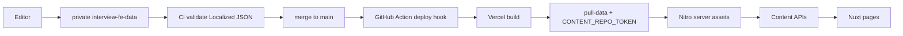
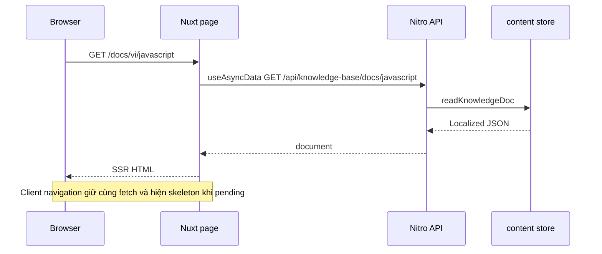
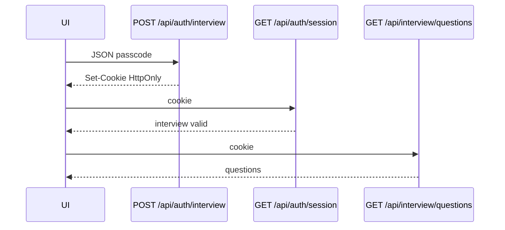

# Senior FE Interview Prep

> 🌍 **Language / Ngôn ngữ:** [🇬🇧 English](./README.md) | [🇻🇳 Tiếng Việt](./README-vi.md)

App Nuxt để **ôn phỏng vấn Senior Frontend**: knowledge base song ngữ, kế hoạch 30 ngày kèm lab, và ngân hàng Q&A khoá PIN.

**Live:** [parker-interview-senior-fe.vercel.app](https://parker-interview-senior-fe.vercel.app)

## Tính năng

- **Knowledge base** — 22 chủ đề vi/en, sidebar, tìm full-text, TOC lồng heading
- **Kế hoạch 30 ngày** — checkpoint theo ngày, lab, xem / sửa tiến độ
- **Interview Q&A** — câu trả lời mẫu sau mã 6 số
- **i18n** — `vi` / `en`, không prefix URL; cookie locale
- **Theme** sáng / tối


## Stack

Nuxt 3 + Nitro · Vue 3 · TypeScript · Tailwind CSS · `@nuxtjs/i18n` (vi/en, `no_prefix`) · Vercel (preset Nitro `vercel`) · Vercel Blob private cho tiến độ plan

## Kiến trúc

```text
pages/                         # route mỏng → view của module
src/modules/
  hub/  knowledge-base/  study-plan/  interview-qa/
  content/                     # block Localized + BlockRenderer
  core/                        # chrome, theme, locale, session
server/api/                    # endpoint Nitro
server/utils/                  # content store, auth, search, progress
scripts/                       # pull-data, export, validate
schema/                        # JSON Schema cho content Localized
i18n/locales/                  # en.json / vi.json
.data/content/                 # gitignore — kéo lúc build
```

Quy ước UI module (đặt tên, scaffold module mới): [STRUCTURE.md](./STRUCTURE.md).

### Mô hình nội dung

KB / plan / Q&A nằm ở repo private [`parker2808/interview-fe-data`](https://github.com/parker2808/interview-fe-data). Mọi chuỗi user-facing là `Localized`:

```ts
type Localized<T = string> = { en: T; vi: T }
```

Doc: `{ sections: { id, title, blocks }[] }`. Kiểu block: `heading`, `paragraph`, `list`, `callout`, `code`, `table`, `senior-answer`, `key-takeaways`, `markdown`, `thematic-break`.

Build (`predev` / `prebuild`) chạy `scripts/pull-data.mjs` → `.data/content`, rồi Nitro copy vào server assets. Client không import file JSON.

### API

| Method | Path | Auth |
|---|---|---|
| `GET` | `/api/knowledge-base/docs` | public |
| `GET` | `/api/knowledge-base/docs/:slug` | public |
| `GET` | `/api/knowledge-base/search?q=&lang=vi\|en&limit=` | public |
| `GET` | `/api/plan/days` | public |
| `GET` | `/api/plan/days/:n` | public |
| `GET` | `/api/plan/resources/:id` | public |
| `GET` | `/api/interview/questions` | phiên interview |
| `POST` | `/api/auth/interview` | body `{ passcode }` → cookie HttpOnly |
| `POST` | `/api/auth/edit` | body `{ passcode }` → cookie HttpOnly |
| `GET` | `/api/auth/session` | báo scope interview + edit |
| `DELETE` | `/api/auth/session?scope=interview\|edit\|all` | xoá cookie |
| `GET` | `/api/progress` | đọc public (Blob) |
| `PUT` / `POST` | `/api/progress` | phiên edit |

### Auth

Cookie HttpOnly, 12 giờ. **`INTERVIEW_PASSCODE` ≠ `EDIT_PASSCODE`** — một PIN không mở cả hai.

- Cookie interview mở `GET /api/interview/questions`
- Cookie edit mở ghi tiến độ plan
- Tuỳ chọn `PROGRESS_WRITE_TOKEN` / `x-edit-token` để ghi progress
- Secret HMAC: `INTERVIEW_TOKEN_SECRET`, `EDIT_TOKEN_SECRET`

### i18n

`@nuxtjs/i18n`, mặc định `vi`, `no_prefix`, cookie `sf_locale`. Route KB: `/docs/:lang/:slug`. Chrome UI lấy từ file locale; thân tài liệu lấy từ JSON Localized.

## Luồng dữ liệu



## Luồng request của một trang



## Mở khoá PIN



Chế độ sửa plan cùng chuỗi với `POST /api/auth/edit` và `PUT /api/progress`.

## Chạy local

**Cần:** Node 22+, npm, và checkout local của `interview-fe-data` hoặc PAT đọc được repo private đó.

```bash
cp .env.example .env          # điền PIN local; không commit secret
# Cách A — data repo local
CONTENT_LOCAL_PATH=/path/to/interview-fe-data npm run dev
# Cách B — kéo bằng token
CONTENT_REPO_TOKEN=… npm run dev
```

| Script | Việc làm |
|---|---|
| `npm run dev` | `data:pull` rồi `nuxt dev` |
| `npm run build` | `data:pull` rồi `nuxt build` (preset Vercel) |
| `npm run data:pull` | Copy `CONTENT_LOCAL_PATH` hoặc tải data repo → `.data/content` |
| `npm run data:export` | Dựng lại JSON từ markdown (maintainer / seed) |
| `npm run data:validate` | Kiểm schema JSON Localized |
| `npm run preview` | Không dùng với preset Vercel khi chạy local |

### Biến môi trường

Không để giá trị secret trong git. Copy `.env.example` rồi điền local / trên Vercel.

| Biến | Ở đâu | Mục đích |
|---|---|---|
| `CONTENT_REPO_TOKEN` | Vercel + tuỳ chọn local | PAT fine-grained, **Contents: Read** trên `interview-fe-data` |
| `CONTENT_REPO_REF` | tuỳ chọn | Git ref để kéo (mặc định `main`) |
| `CONTENT_REPO_OWNER` / `CONTENT_REPO_NAME` | tuỳ chọn | Đổi toạ độ data repo |
| `CONTENT_LOCAL_PATH` | local | Checkout hoặc export data repo; bỏ qua GitHub |
| `INTERVIEW_PASSCODE` | Vercel + local | PIN 6 số cho Q&A |
| `EDIT_PASSCODE` | Vercel + local | PIN 6 số sửa plan (phải khác) |
| `INTERVIEW_TOKEN_SECRET` / `EDIT_TOKEN_SECRET` | tuỳ chọn | Secret HMAC cho session token |
| `PROGRESS_WRITE_TOKEN` | tuỳ chọn | Auth ghi progress thay thế |
| `BLOB_READ_WRITE_TOKEN` | Vercel | Blob private cho `/api/progress` |
| `VERCEL_DEPLOY_HOOK_URL` | secret **data repo** | Action trên `main` kích hoạt rebuild site |

## Deploy và cập nhật nội dung

1. Sửa JSON trong **`parker2808/interview-fe-data`**.
2. CI trên PR validate JSON Localized.
3. Merge `main` → Action `POST` deploy hook Vercel.
4. Build Vercel chạy `data:pull` với `CONTENT_REPO_TOKEN`, copy content vào Nitro, deploy.

Push repo app cũng rebuild trên Vercel. Content **không** nằm trong repo này.

**Backup / toàn vẹn:** nguồn sự thật là git trên data repo private. Vercel chỉ serve bản build thành công gần nhất. Build fail thì deployment cũ vẫn chạy. JSON tiến độ nằm ở Blob private, tách khỏi content.

## License

Dùng miễn phí để ôn phỏng vấn cá nhân. Ghi nguồn nếu chia sẻ công khai.
