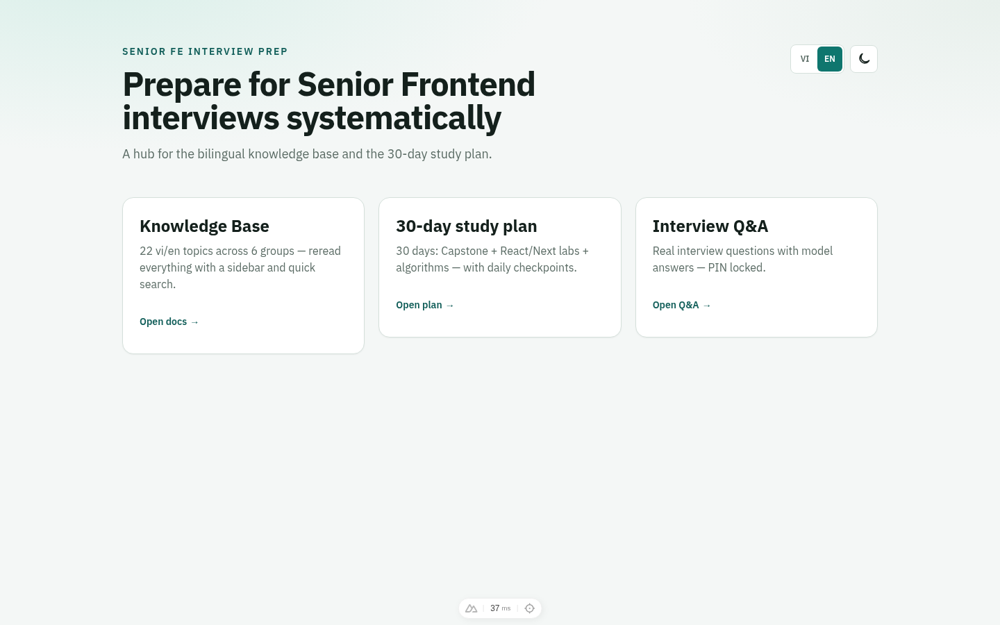
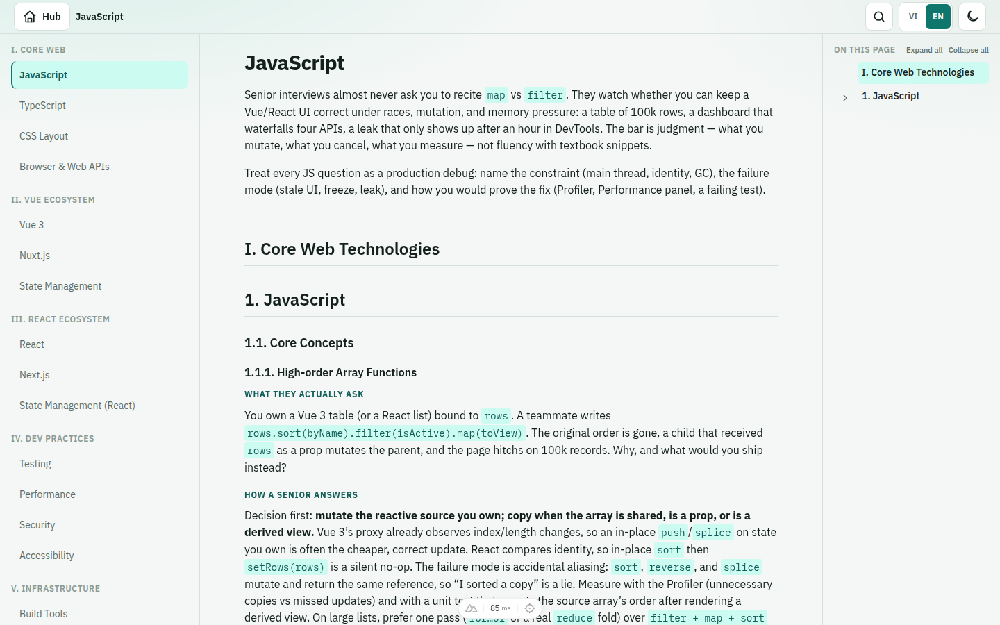
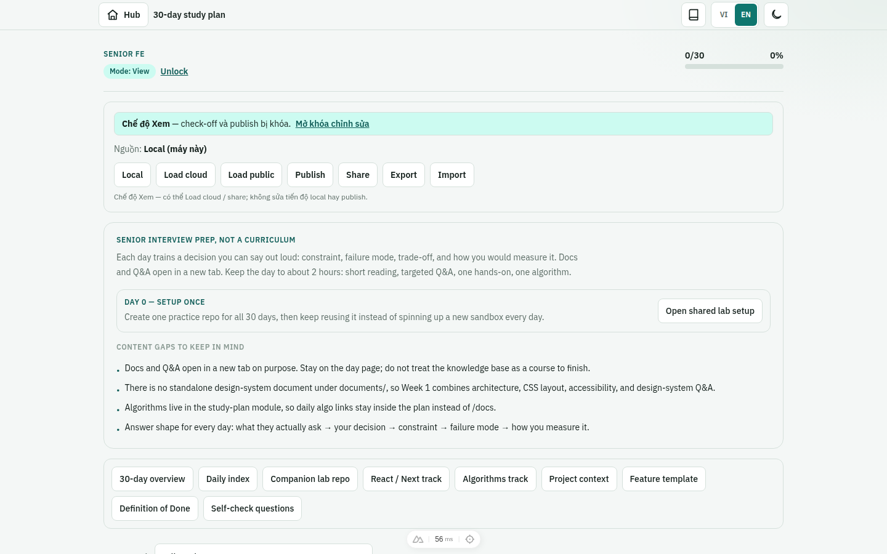
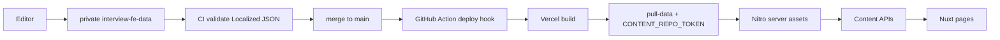
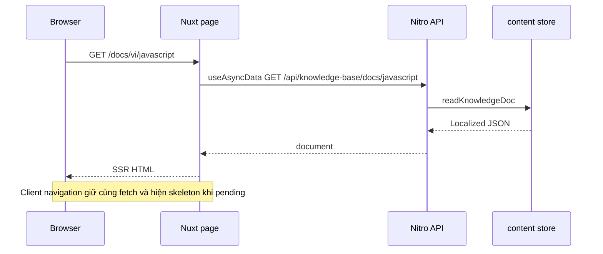
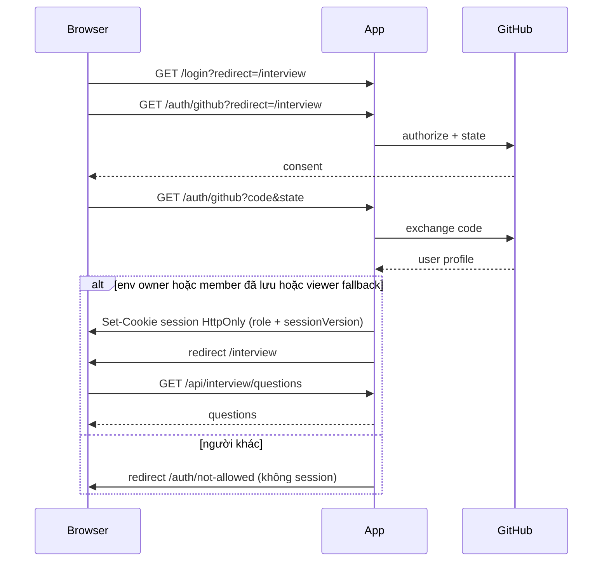
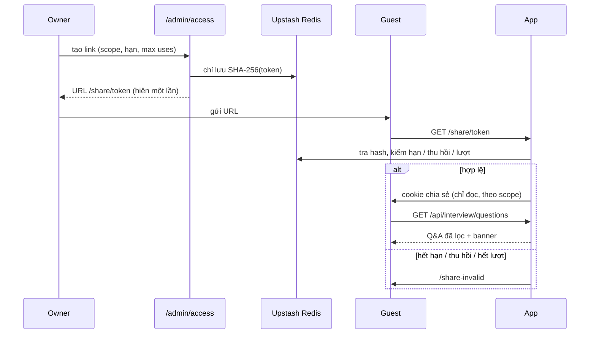

# Senior FE Interview Prep

> 🌍 **Language / Ngôn ngữ:** [🇬🇧 English](./README.md) | [🇻🇳 Tiếng Việt](./README-vi.md)

App Nuxt để **ôn phỏng vấn Senior Frontend**: knowledge base song ngữ, kế hoạch 30 ngày kèm lab, và ngân hàng Q&A khoá bằng GitHub.

**Live:** [parker-interview-senior-fe.vercel.app](https://parker-interview-senior-fe.vercel.app)

## Tính năng

- **Knowledge base** — 22 chủ đề vi/en, sidebar, tìm full-text, TOC lồng heading
- **Kế hoạch 30 ngày** — checkpoint theo ngày, lab, xem / sửa tiến độ
- **Interview Q&A** — câu trả lời mẫu sau GitHub OAuth (owner / viewer / link chia sẻ)
- **Truy cập / Chia sẻ** — admin chỉ owner: quản lý thành viên và link có hạn
- **i18n** — `vi` / `en`, không prefix URL; cookie locale
- **Theme** sáng / tối





## Stack

Nuxt 3 + Nitro · Vue 3 · TypeScript · Tailwind CSS · `@nuxtjs/i18n` (vi/en, `no_prefix`) · Vercel (preset Nitro `vercel`) · Vercel Blob private cho tiến độ plan

## Kiến trúc

```text
pages/                         # route mỏng → view của module
src/modules/
  hub/  knowledge-base/  study-plan/  interview-qa/  access/
  content/                     # block Localized + BlockRenderer
  core/                        # chrome, theme, locale, session
server/api/                    # endpoint Nitro
server/utils/                  # content store, auth, search, progress
scripts/                       # pull-data, export, validate
schema/                        # JSON Schema cho content Localized
i18n/locales/                  # en.json / vi.json
.data/content/                 # gitignore — kéo lúc build
```

Quy ước UI module (đặt tên, scaffold module mới): [STRUCTURE.md](./STRUCTURE.md).

### Mô hình nội dung

KB / plan / Q&A nằm ở repo private [`parker2808/interview-fe-data`](https://github.com/parker2808/interview-fe-data). Mọi chuỗi user-facing là `Localized`:

```ts
type Localized<T = string> = { en: T; vi: T }
```

Doc: `{ sections: { id, title, blocks }[] }`. Kiểu block: `heading`, `paragraph`, `list`, `callout`, `code`, `table`, `senior-answer`, `key-takeaways`, `markdown`, `thematic-break`.

Build (`predev` / `prebuild`) chạy `scripts/pull-data.mjs` → `.data/content`, rồi Nitro copy vào server assets. Client không import file JSON.

### API

| Method | Path | Auth |
|---|---|---|
| `GET` | `/api/knowledge-base/docs` | public (cache CDN) |
| `GET` | `/api/knowledge-base/docs/:slug` | public (cache CDN) |
| `GET` | `/api/knowledge-base/search?q=&lang=vi\|en&limit=` | public (cache CDN + giới hạn input + rate limit best-effort) |
| `GET` | `/api/plan/days` | public (cache CDN) |
| `GET` | `/api/plan/days/:n` | public (cache CDN) |
| `GET` | `/api/plan/resources/:id` | public (cache CDN) |
| `GET` | `/api/interview/questions` | owner, viewer, hoặc share session theo scope |
| `GET` | `/auth/github` | bắt đầu + callback OAuth |
| `GET` | `/share/:token` | đổi token thành session chỉ đọc |
| `POST` | `/api/auth/logout` | xoá session |
| `GET` | `/api/auth/session` | `{ ok, authenticated, role, user, share }` |
| `GET` | `/api/progress` | owner hoặc viewer |
| `PUT` / `POST` | `/api/progress` | chỉ owner |
| `GET`/`POST`/`PATCH`/`DELETE` | `/api/admin/*` | chỉ owner (404/401 nếu không) |

Mọi `/api/**` khác là **default-deny** (`401` JSON) trừ khi được thêm vào allowlist trong `src/modules/core/utils/public-api.util.ts`.

API đọc public gửi `Cache-Control: public, s-maxage=86400, stale-while-revalidate=604800`. Session, Q&A, progress, admin gửi `private, no-store` — không cache trên CDN.

Search từ chối `q` quá dài (tối đa 100), `lang`/`limit` sai (`limit` tối đa 50). Search và thử share-token dùng Upstash Redis khi có, không thì limiter in-memory (một isolate). **Bật Vercel Firewall** để chặn spam thật: Project → Firewall → rule rate-limit cho `/api/knowledge-base/search` (ví dụ 30 request / phút / IP) và tuỳ chọn `/share/**`.

### Auth

GitHub OAuth qua [`nuxt-auth-utils`](https://github.com/atinux/nuxt-auth-utils). Cookie HttpOnly đã niêm (`nuxt-session`), 7 ngày, `Secure` trên production, `SameSite=Lax`. Thư viện dùng OAuth `state` (và PKCE nếu provider hỗ trợ).

**Public (không login):** trang knowledge base + plan (chỉ đọc) và API nội dung tương ứng.

**Cần login:** `/interview`, `/api/interview/*`, đọc progress, và mọi API không nằm trong allowlist.

**Chỉ owner:** `/admin/access`, `/api/admin/*`, sửa plan / ghi progress. Mục Access ẩn khỏi menu avatar nếu không phải owner. Non-owner nhận `404` trên trang và `404`/`401` trên API admin.

Role được tính lại **mỗi** request bảo vệ (không tin cookie):

1. **Env owner** — `AUTH_OWNER_GITHUB_LOGINS` (mặc định `parker2808`) và, nếu có, `AUTH_OWNER_GITHUB_IDS` (vd `38419968`). Login **và** id phải khớp khi đã set id. Env owner không thể gỡ / hạ quyền trong UI.
2. **Member đã lưu** — thêm trong `/admin/access` theo username GitHub. Id số được resolve lúc thêm qua GitHub public API và dùng khi login (đổi username không cướp quyền). Ghi chú + hạn tuỳ chọn. Xóa hoặc đổi role tăng `sessionVersion` nên cookie cũ chết ngay.
3. **Viewer fallback** — `AUTH_ALLOWED_GITHUB_LOGINS` / `AUTH_ALLOWED_GITHUB_IDS` (rỗng nếu không set). Giữ để tương thích; nên thêm member trong UI để có id và thu hồi được.

**Owner** sửa plan, ghi progress, mở module Access. **Viewer** đọc Q&A và progress; mọi mutation trả `403`, UI sửa bị ẩn.

#### Link chia sẻ

Owner tạo link với scope (toàn bộ Q&A, category, hoặc id câu hỏi), hạn bắt buộc (1h / 1d / 7d / 30d / tùy chọn, tối đa 90 ngày), max uses và nhãn tuỳ chọn. Token ≥128 bit ngẫu nhiên; chỉ lưu hash SHA-256. Vào `/share/<token>` tạo session **chỉ đọc** riêng (cùng cookie niêm, không có `user`, không có quyền owner/viewer). Q&A được lọc theo scope. Link hết hạn / bị thu hồi / hết lượt hiện trang thân thiện. Thử token bị rate-limit.

#### Storage (Upstash Redis)

Thành viên, hash link, nhật ký, và rate limit phân tán nằm ở Upstash Redis qua REST (`KV_REST_API_URL`/`KV_REST_API_TOKEN` từ Vercel Marketplace, hoặc `UPSTASH_REDIS_REST_*`). Local/test dùng store in-memory. Thiếu Redis trên production thì **env owner vẫn vào được**; module Access hiện thông báo “chưa cấu hình storage”, ghi member/link trả `503`.

#### Setup OAuth + Upstash (Parker)

1. GitHub → Settings → Developer settings → **OAuth Apps** → New OAuth App.
2. **Homepage URL:** `https://parker-interview-senior-fe.vercel.app`
3. **Authorization callback URL:** `https://parker-interview-senior-fe.vercel.app/auth/github`  
   OAuth App của GitHub chỉ nhận **một** callback. Preview (`*.vercel.app`) không login được trừ khi tạo OAuth App thứ hai cho origin đó.
4. Local: OAuth App thứ hai, homepage `http://localhost:3000`, callback `http://localhost:3000/auth/github`.
5. Tạo mật khẩu session (32+ ký tự): `openssl rand -base64 32`
6. **Upstash Redis (cần cho thành viên / link chia sẻ):** Vercel → Project → tab **Storage** → **Upstash** → tạo/kết nối Redis vào project. Vercel tự inject `KV_REST_API_URL` và `KV_REST_API_TOKEN` (hoặc cặp `UPSTASH_REDIS_REST_*`).
7. Thêm biến trên Vercel: `NUXT_SESSION_PASSWORD`, `NUXT_OAUTH_GITHUB_CLIENT_ID`, `NUXT_OAUTH_GITHUB_CLIENT_SECRET`, `AUTH_OWNER_GITHUB_LOGINS=parker2808`, `AUTH_OWNER_GITHUB_IDS=38419968`.
8. Redeploy. Xoá `INTERVIEW_PASSCODE`, `EDIT_PASSCODE`, `INTERVIEW_TOKEN_SECRET`, `EDIT_TOKEN_SECRET`, `PROGRESS_WRITE_TOKEN`. `AUTH_ALLOWED_GITHUB_LOGINS` chỉ còn là viewer fallback tuỳ chọn.

### i18n

`@nuxtjs/i18n`, mặc định `vi`, `no_prefix`, cookie `sf_locale`. Route KB: `/docs/:lang/:slug`. Chrome UI lấy từ file locale; thân tài liệu lấy từ JSON Localized.

## Luồng dữ liệu



## Luồng request của một trang



## GitHub OAuth



Trang plan vẫn public. Nút sửa và ghi progress chỉ hiện với **owner**.

## Luồng link chia sẻ



## Chạy local

**Cần:** Node 22+, npm, và checkout local của `interview-fe-data` hoặc PAT đọc được repo private đó.

```bash
cp .env.example .env          # điền OAuth + session password; không commit secret
# Cách A — data repo local
CONTENT_LOCAL_PATH=/path/to/interview-fe-data npm run dev
# Cách B — kéo bằng token
CONTENT_REPO_TOKEN=… npm run dev
```

| Script | Việc làm |
|---|---|
| `npm run dev` | `data:pull` rồi `nuxt dev` |
| `npm run build` | `data:pull` rồi `nuxt build` (preset Vercel) |
| `npm run data:pull` | Copy `CONTENT_LOCAL_PATH` hoặc tải data repo → `.data/content` |
| `npm run data:export` | Dựng lại JSON từ markdown (maintainer / seed) |
| `npm run data:validate` | Kiểm schema JSON Localized |
| `npm run preview` | Không dùng với preset Vercel khi chạy local |

### Biến môi trường

Không để giá trị secret trong git. Copy `.env.example` rồi điền local / trên Vercel.

| Biến | Ở đâu | Mục đích |
|---|---|---|
| `CONTENT_REPO_TOKEN` | Vercel + tuỳ chọn local | PAT fine-grained, **Contents: Read** trên `interview-fe-data` |
| `CONTENT_REPO_REF` | tuỳ chọn | Git ref để kéo (mặc định `main`) |
| `CONTENT_REPO_OWNER` / `CONTENT_REPO_NAME` | tuỳ chọn | Đổi toạ độ data repo |
| `CONTENT_LOCAL_PATH` | local | Checkout hoặc export data repo; bỏ qua GitHub |
| `NUXT_SESSION_PASSWORD` | Vercel + local | 32+ ký tự; niêm cookie session |
| `NUXT_OAUTH_GITHUB_CLIENT_ID` | Vercel + local | Client id OAuth App |
| `NUXT_OAUTH_GITHUB_CLIENT_SECRET` | Vercel + local | Client secret OAuth App |
| `AUTH_OWNER_GITHUB_LOGINS` | Vercel + local | Env owner (mặc định `parker2808`); khóa trong UI |
| `AUTH_OWNER_GITHUB_IDS` | Vercel + local | Id số AND với login owner (`38419968`) |
| `AUTH_ALLOWED_GITHUB_LOGINS` | tuỳ chọn | Danh sách **viewer** fallback (tương thích; rỗng nếu không set) |
| `AUTH_ALLOWED_GITHUB_IDS` | tuỳ chọn | AND với login viewer fallback |
| `KV_REST_API_URL` / `KV_REST_API_TOKEN` | Vercel (Marketplace) | Upstash Redis REST (hoặc `UPSTASH_REDIS_REST_*`) |
| `BLOB_READ_WRITE_TOKEN` | Vercel | Blob private cho `/api/progress` |
| `VERCEL_DEPLOY_HOOK_URL` | secret **data repo** | Action trên `main` kích hoạt rebuild site |

## Deploy và cập nhật nội dung

1. Sửa JSON trong **`parker2808/interview-fe-data`**.
2. CI trên PR validate JSON Localized.
3. Merge `main` → Action `POST` deploy hook Vercel.
4. Build Vercel chạy `data:pull` với `CONTENT_REPO_TOKEN`, copy content vào Nitro, deploy.

Push repo app cũng rebuild trên Vercel. Content **không** nằm trong repo này.

**Backup / toàn vẹn:** nguồn sự thật là git trên data repo private. Vercel chỉ serve bản build thành công gần nhất. Build fail thì deployment cũ vẫn chạy. JSON tiến độ nằm ở Blob private, tách khỏi content.

## License

Dùng miễn phí để ôn phỏng vấn cá nhân. Ghi nguồn nếu chia sẻ công khai.
