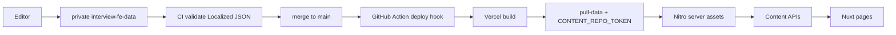
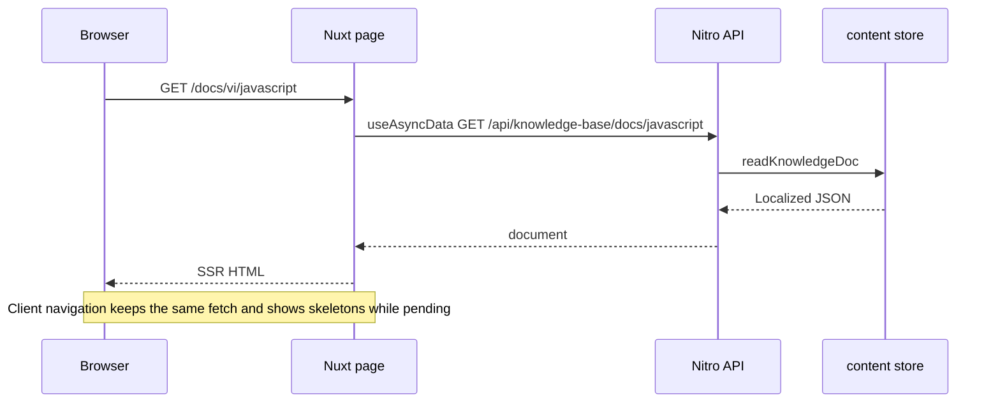
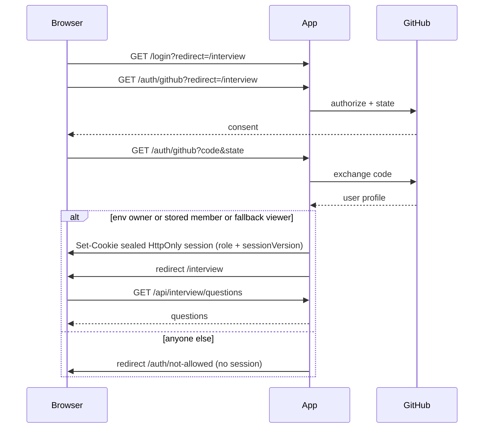
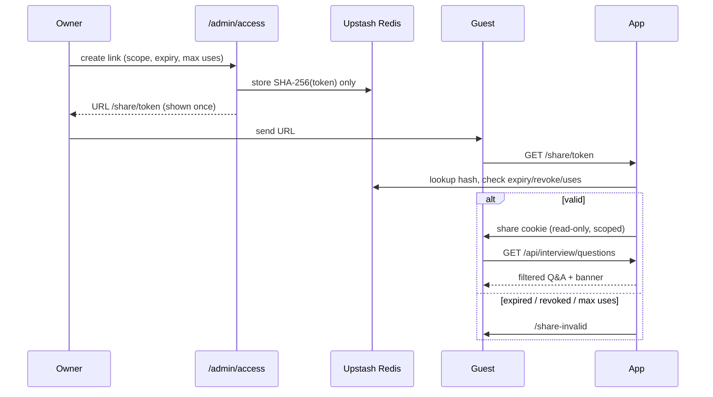

# Senior FE Interview Prep

> 🌍 **Language / Ngôn ngữ:** [🇬🇧 English](./README.md) | [🇻🇳 Tiếng Việt](./README-vi.md)

Nuxt app for **Senior Frontend interview prep**: a bilingual knowledge base, a 30-day plan with labs, and a GitHub-protected Q&A bank.

**Live:** [parker-interview-senior-fe.vercel.app](https://parker-interview-senior-fe.vercel.app)

## Features

- **Knowledge base** — 22 vi/en topics, sidebar, full-text search, nested heading TOC
- **30-day plan** — daily checkpoints, lab links, view vs edit progress
- **Interview Q&A** — model answers behind GitHub OAuth (owner / viewer / share link)
- **Access / Sharing** — owner-only admin to manage members and expiring share links
- **i18n** — `vi` / `en`, no URL prefix; locale cookie
- **Light / dark** theme


## Stack

Nuxt 3 + Nitro · Vue 3 · TypeScript · Tailwind CSS · `@nuxtjs/i18n` (vi/en, `no_prefix`) · Vercel (Nitro `vercel` preset) · private Vercel Blob for plan progress

## Architecture

```text
pages/                         # thin routes → module views
src/modules/
  hub/  knowledge-base/  study-plan/  interview-qa/  access/
  content/                     # Localized blocks + BlockRenderer
  core/                        # chrome, theme, locale, session
server/api/                    # Nitro endpoints
server/utils/                  # content store, auth, search, progress
scripts/                       # pull-data, export, validate
schema/                        # JSON Schema for Localized content
i18n/locales/                  # en.json / vi.json
.data/content/                 # gitignored build-time pull
```

UI module conventions (naming, new-module scaffold): [STRUCTURE.md](./STRUCTURE.md).

### Content model

KB / plan / Q&A live in private [`parker2808/interview-fe-data`](https://github.com/parker2808/interview-fe-data). Every user-facing string is `Localized`:

```ts
type Localized<T = string> = { en: T; vi: T }
```

Docs are `{ sections: { id, title, blocks }[] }`. Block types: `heading`, `paragraph`, `list`, `callout`, `code`, `table`, `senior-answer`, `key-takeaways`, `markdown`, `thematic-break`.

Build (`predev` / `prebuild`) runs `scripts/pull-data.mjs` → `.data/content`, then Nitro copies that tree into server assets. The client never imports the JSON files.

### APIs

| Method | Path | Auth |
|---|---|---|
| `GET` | `/api/knowledge-base/docs` | public (CDN cache) |
| `GET` | `/api/knowledge-base/docs/:slug` | public (CDN cache) |
| `GET` | `/api/knowledge-base/search?q=&lang=vi\|en&limit=` | public (CDN cache + input caps + best-effort rate limit) |
| `GET` | `/api/plan/days` | public (CDN cache) |
| `GET` | `/api/plan/days/:n` | public (CDN cache) |
| `GET` | `/api/plan/resources/:id` | public (CDN cache) |
| `GET` | `/api/interview/questions` | owner, viewer, or scoped share session |
| `GET` | `/auth/github` | GitHub OAuth start + callback |
| `GET` | `/share/:token` | consume share link → read-only session |
| `POST` | `/api/auth/logout` | clears sealed session |
| `GET` | `/api/auth/session` | `{ ok, authenticated, role, user, share }` |
| `GET` | `/api/progress` | owner or viewer |
| `PUT` / `POST` | `/api/progress` | owner only |
| `GET`/`POST`/`PATCH`/`DELETE` | `/api/admin/*` | owner only (404/401 otherwise) |

Every other `/api/**` route is **default-deny** (`401` JSON) unless it is added to the public allowlist in `src/modules/core/utils/public-api.util.ts`.

Public reads send `Cache-Control: public, s-maxage=86400, stale-while-revalidate=604800`. Session, Q&A, progress, and admin responses send `private, no-store` and must not be CDN-cached.

Search rejects oversized/`lang`/`limit` abuse (`q` max 100, `limit` cap 50). Search and share-token attempts use Upstash Redis when configured, otherwise an in-memory limiter (one isolate). **Enable Vercel Firewall** for real protection: Project → Firewall → add a rate-limit rule on `/api/knowledge-base/search` (for example 30 requests / minute / IP) and optionally on `/share/**`.

### Auth

GitHub OAuth via [`nuxt-auth-utils`](https://github.com/atinux/nuxt-auth-utils). Sealed HttpOnly cookie (`nuxt-session`), 7 days, `Secure` in production, `SameSite=Lax`. Library uses OAuth `state` (and PKCE when the provider supports it).

**Public (no login):** knowledge base + plan pages (read-only) and their content APIs.

**Login required:** `/interview`, `/api/interview/*`, progress reads, and every non-allowlisted API.

**Owner only:** `/admin/access`, `/api/admin/*`, plan edit / progress writes. The Access entry is hidden from the avatar menu unless the session is an owner. Non-owners get `404` on the page and `404`/`401` on admin APIs.

Roles are resolved on **every** protected request (cookie role is not trusted):

1. **Env owner** — `AUTH_OWNER_GITHUB_LOGINS` (default `parker2808`) and, when set, `AUTH_OWNER_GITHUB_IDS` (e.g. `38419968`). Login **and** id must match if ids are set. Env owners cannot be removed or demoted in the UI.
2. **Stored member** — added in `/admin/access` by GitHub username. The numeric id is resolved via the public GitHub API at add time and used at login (renames cannot hijack access). Optional note + expiry. Removing or changing role bumps `sessionVersion` so existing cookies stop working immediately.
3. **Fallback viewer** — `AUTH_ALLOWED_GITHUB_LOGINS` / `AUTH_ALLOWED_GITHUB_IDS` (empty when unset). Kept for backward compatibility; prefer stored members so ids and revocation work.

**Owner** can edit the plan, write progress, and open the Access module. **Viewer** can read Q&A and progress; every mutation returns `403` and edit UI is hidden.

#### Share links

Owners mint a link with a scope (all Q&A, selected categories, or question ids), required expiry (1h / 1d / 7d / 30d / custom, max 90 days), optional max uses and label. The token is ≥128 bits of randomness; only a SHA-256 hash is stored. Visiting `/share/<token>` creates a **separate** read-only share session (same sealed cookie, no `user`, never owner/viewer powers). Q&A is filtered to the scope. Expired / revoked / max-used links show a friendly page. Token attempts are rate-limited.

#### Storage (Upstash Redis)

Members, share hashes, the audit log, and distributed rate limits persist in Upstash Redis via the REST client (`KV_REST_API_URL`/`KV_REST_API_TOKEN` from the Vercel Marketplace integration, or `UPSTASH_REDIS_REST_URL`/`UPSTASH_REDIS_REST_TOKEN`). Local/tests use an in-memory store. If Redis env is missing in production, **env owners still work**; the Access module shows a “storage not configured” notice and member/share writes return `503`.

#### GitHub OAuth + Upstash setup (Parker)

1. GitHub → Settings → Developer settings → **OAuth Apps** → New OAuth App.
2. **Homepage URL:** `https://parker-interview-senior-fe.vercel.app`
3. **Authorization callback URL:** `https://parker-interview-senior-fe.vercel.app/auth/github`  
   GitHub OAuth Apps accept **one** callback URL. Preview deployments (`*.vercel.app`) cannot sign in unless you create a second OAuth App whose callback is that preview origin, or skip login on previews.
4. For local dev, create a **second** OAuth App: homepage `http://localhost:3000`, callback `http://localhost:3000/auth/github`. Put those client id/secret only in local `.env`.
5. Generate a session password (32+ characters): `openssl rand -base64 32`
6. **Upstash Redis (required for members / share links):** Vercel → Project → **Storage** tab → **Upstash** → create/connect a Redis database to this project. Vercel injects `KV_REST_API_URL` and `KV_REST_API_TOKEN` (or the `UPSTASH_REDIS_REST_*` pair) automatically.
7. In Vercel → Project → Settings → Environment Variables, set:

   | Variable | Production |
   |---|---|
   | `NUXT_SESSION_PASSWORD` | the 32+ char secret |
   | `NUXT_OAUTH_GITHUB_CLIENT_ID` | production OAuth App client id |
   | `NUXT_OAUTH_GITHUB_CLIENT_SECRET` | production client secret |
   | `AUTH_OWNER_GITHUB_LOGINS` | `parker2808` |
   | `AUTH_OWNER_GITHUB_IDS` | `38419968` |

8. Redeploy. Then **remove** `INTERVIEW_PASSCODE`, `EDIT_PASSCODE`, `INTERVIEW_TOKEN_SECRET`, `EDIT_TOKEN_SECRET`, and `PROGRESS_WRITE_TOKEN` from Vercel (they are unused). `AUTH_ALLOWED_GITHUB_LOGINS` is optional fallback viewers only.

### i18n

`@nuxtjs/i18n`, default `vi`, strategy `no_prefix`, cookie `sf_locale`. KB routes are `/docs/:lang/:slug`. UI chrome uses locale files; document bodies come from Localized JSON.

## Data flow



## Page request flow



## GitHub OAuth



Plan view stays public. Edit controls and progress writes appear only for **owners**.

## Share-link flow



## Local development

**Needs:** Node 22+, npm, and either a local checkout of `interview-fe-data` or a GitHub PAT that can read that private repo.

```bash
cp .env.example .env          # fill OAuth + session password; never commit secrets
# Option A — local data repo
CONTENT_LOCAL_PATH=/path/to/interview-fe-data npm run dev
# Option B — token pull
CONTENT_REPO_TOKEN=… npm run dev
```

| Script | What it does |
|---|---|
| `npm run dev` | `data:pull` then `nuxt dev` |
| `npm run build` | `data:pull` then `nuxt build` (Vercel preset) |
| `npm run data:pull` | Copy `CONTENT_LOCAL_PATH` or download the data repo → `.data/content` |
| `npm run data:export` | Rebuild JSON from markdown sources (maintainer / seed) |
| `npm run data:validate` | Schema-check Localized JSON |
| `npm run preview` | Not used for the Vercel preset locally |

### Environment

No secret values belong in git. Copy `.env.example` and fill locally / on Vercel.

| Variable | Where | Purpose |
|---|---|---|
| `CONTENT_REPO_TOKEN` | Vercel + optional local | Fine-grained PAT, **Contents: Read** on `interview-fe-data` |
| `CONTENT_REPO_REF` | optional | Git ref to pull (default `main`) |
| `CONTENT_REPO_OWNER` / `CONTENT_REPO_NAME` | optional | Override data-repo coordinates |
| `CONTENT_LOCAL_PATH` | local | Checkout or export of the data repo; skips GitHub |
| `NUXT_SESSION_PASSWORD` | Vercel + local | 32+ chars; seals the HttpOnly session cookie |
| `NUXT_OAUTH_GITHUB_CLIENT_ID` | Vercel + local | GitHub OAuth App client id |
| `NUXT_OAUTH_GITHUB_CLIENT_SECRET` | Vercel + local | GitHub OAuth App client secret |
| `AUTH_OWNER_GITHUB_LOGINS` | Vercel + local | Env owners (default `parker2808`); locked in the UI |
| `AUTH_OWNER_GITHUB_IDS` | Vercel + local | Numeric ids AND-matched with owner logins (`38419968`) |
| `AUTH_ALLOWED_GITHUB_LOGINS` | optional | Fallback **viewer** list (backward compat; empty when unset) |
| `AUTH_ALLOWED_GITHUB_IDS` | optional | AND-matched with fallback viewer logins |
| `KV_REST_API_URL` / `KV_REST_API_TOKEN` | Vercel (Marketplace) | Upstash Redis REST (or `UPSTASH_REDIS_REST_*`) |
| `BLOB_READ_WRITE_TOKEN` | Vercel | Private Blob store for `/api/progress` |
| `VERCEL_DEPLOY_HOOK_URL` | **data repo** secret | Action on `main` triggers a site rebuild |

## Deploy and content updates

1. Edit JSON in **`parker2808/interview-fe-data`**.
2. PR CI validates Localized JSON.
3. Merge to `main` → Action `POST`s the Vercel deploy hook.
4. Vercel build runs `data:pull` with `CONTENT_REPO_TOKEN`, copies content into Nitro, deploys.

App repo pushes also rebuild on Vercel. Content is **not** in this repo.

**Backup / integrity:** source of truth is git on the private data repo. Vercel only serves the last successful build. If a build fails, the previous deployment keeps serving. Progress JSON lives in private Blob, separate from content.

## License

Free for personal interview prep. Credit the source if you share it.
