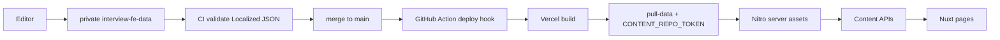
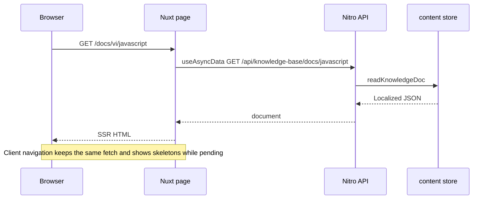
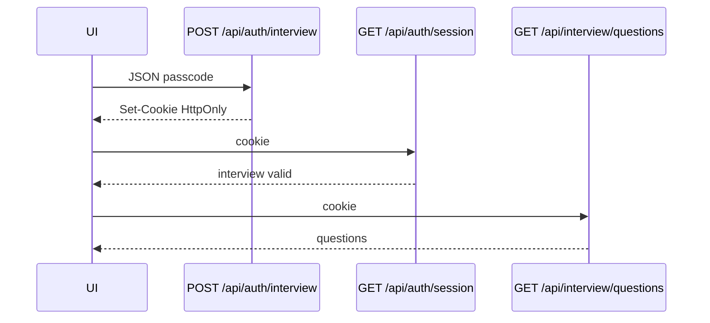

# Senior FE Interview Prep

> 🌍 **Language / Ngôn ngữ:** [🇬🇧 English](./README.md) | [🇻🇳 Tiếng Việt](./README-vi.md)

Nuxt app for **Senior Frontend interview prep**: a bilingual knowledge base, a 30-day plan with labs, and a PIN-protected Q&A bank.

**Live:** [parker-interview-senior-fe.vercel.app](https://parker-interview-senior-fe.vercel.app)

## Features

- **Knowledge base** — 22 vi/en topics, sidebar, full-text search, nested heading TOC
- **30-day plan** — daily checkpoints, lab links, view vs edit progress
- **Interview Q&A** — model answers behind a 6-digit PIN
- **i18n** — `vi` / `en`, no URL prefix; locale cookie
- **Light / dark** theme


## Stack

Nuxt 3 + Nitro · Vue 3 · TypeScript · Tailwind CSS · `@nuxtjs/i18n` (vi/en, `no_prefix`) · Vercel (Nitro `vercel` preset) · private Vercel Blob for plan progress

## Architecture

```text
pages/                         # thin routes → module views
src/modules/
  hub/  knowledge-base/  study-plan/  interview-qa/
  content/                     # Localized blocks + BlockRenderer
  core/                        # chrome, theme, locale, session
server/api/                    # Nitro endpoints
server/utils/                  # content store, auth, search, progress
scripts/                       # pull-data, export, validate
schema/                        # JSON Schema for Localized content
i18n/locales/                  # en.json / vi.json
.data/content/                 # gitignored build-time pull
```

UI module conventions (naming, new-module scaffold): [STRUCTURE.md](./STRUCTURE.md).

### Content model

KB / plan / Q&A live in private [`parker2808/interview-fe-data`](https://github.com/parker2808/interview-fe-data). Every user-facing string is `Localized`:

```ts
type Localized<T = string> = { en: T; vi: T }
```

Docs are `{ sections: { id, title, blocks }[] }`. Block types: `heading`, `paragraph`, `list`, `callout`, `code`, `table`, `senior-answer`, `key-takeaways`, `markdown`, `thematic-break`.

Build (`predev` / `prebuild`) runs `scripts/pull-data.mjs` → `.data/content`, then Nitro copies that tree into server assets. The client never imports the JSON files.

### APIs

| Method | Path | Auth |
|---|---|---|
| `GET` | `/api/knowledge-base/docs` | public |
| `GET` | `/api/knowledge-base/docs/:slug` | public |
| `GET` | `/api/knowledge-base/search?q=&lang=vi\|en&limit=` | public |
| `GET` | `/api/plan/days` | public |
| `GET` | `/api/plan/days/:n` | public |
| `GET` | `/api/plan/resources/:id` | public |
| `GET` | `/api/interview/questions` | interview session |
| `POST` | `/api/auth/interview` | body `{ passcode }` → HttpOnly cookie |
| `POST` | `/api/auth/edit` | body `{ passcode }` → HttpOnly cookie |
| `GET` | `/api/auth/session` | reports interview + edit scopes |
| `DELETE` | `/api/auth/session?scope=interview\|edit\|all` | clears cookies |
| `GET` | `/api/progress` | public read (Blob) |
| `PUT` / `POST` | `/api/progress` | edit session |

### Auth

HttpOnly cookies, 12h. **`INTERVIEW_PASSCODE` ≠ `EDIT_PASSCODE`** — one PIN does not unlock both.

- Interview cookie unlocks `GET /api/interview/questions`
- Edit cookie unlocks plan progress writes
- Optional `PROGRESS_WRITE_TOKEN` / `x-edit-token` for progress writes
- Token HMAC secrets: `INTERVIEW_TOKEN_SECRET`, `EDIT_TOKEN_SECRET`

### i18n

`@nuxtjs/i18n`, default `vi`, strategy `no_prefix`, cookie `sf_locale`. KB routes are `/docs/:lang/:slug`. UI chrome uses locale files; document bodies come from Localized JSON.

## Data flow



## Page request flow



## PIN unlock



Edit mode is the same sequence against `POST /api/auth/edit` and `PUT /api/progress`.

## Local development

**Needs:** Node 22+, npm, and either a local checkout of `interview-fe-data` or a GitHub PAT that can read that private repo.

```bash
cp .env.example .env          # fill PINs locally; never commit secrets
# Option A — local data repo
CONTENT_LOCAL_PATH=/path/to/interview-fe-data npm run dev
# Option B — token pull
CONTENT_REPO_TOKEN=… npm run dev
```

| Script | What it does |
|---|---|
| `npm run dev` | `data:pull` then `nuxt dev` |
| `npm run build` | `data:pull` then `nuxt build` (Vercel preset) |
| `npm run data:pull` | Copy `CONTENT_LOCAL_PATH` or download the data repo → `.data/content` |
| `npm run data:export` | Rebuild JSON from markdown sources (maintainer / seed) |
| `npm run data:validate` | Schema-check Localized JSON |
| `npm run preview` | Not used for the Vercel preset locally |

### Environment

No secret values belong in git. Copy `.env.example` and fill locally / on Vercel.

| Variable | Where | Purpose |
|---|---|---|
| `CONTENT_REPO_TOKEN` | Vercel + optional local | Fine-grained PAT, **Contents: Read** on `interview-fe-data` |
| `CONTENT_REPO_REF` | optional | Git ref to pull (default `main`) |
| `CONTENT_REPO_OWNER` / `CONTENT_REPO_NAME` | optional | Override data-repo coordinates |
| `CONTENT_LOCAL_PATH` | local | Checkout or export of the data repo; skips GitHub |
| `INTERVIEW_PASSCODE` | Vercel + local | 6-digit Q&A PIN |
| `EDIT_PASSCODE` | Vercel + local | 6-digit plan-edit PIN (must differ) |
| `INTERVIEW_TOKEN_SECRET` / `EDIT_TOKEN_SECRET` | optional | HMAC secrets for session tokens |
| `PROGRESS_WRITE_TOKEN` | optional | Alternate progress write auth |
| `BLOB_READ_WRITE_TOKEN` | Vercel | Private Blob store for `/api/progress` |
| `VERCEL_DEPLOY_HOOK_URL` | **data repo** secret | Action on `main` triggers a site rebuild |

## Deploy and content updates

1. Edit JSON in **`parker2808/interview-fe-data`**.
2. PR CI validates Localized JSON.
3. Merge to `main` → Action `POST`s the Vercel deploy hook.
4. Vercel build runs `data:pull` with `CONTENT_REPO_TOKEN`, copies content into Nitro, deploys.

App repo pushes also rebuild on Vercel. Content is **not** in this repo.

**Backup / integrity:** source of truth is git on the private data repo. Vercel only serves the last successful build. If a build fails, the previous deployment keeps serving. Progress JSON lives in private Blob, separate from content.

## License

Free for personal interview prep. Credit the source if you share it.
