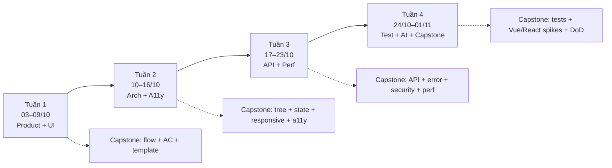

# Plan ôn tập 30 ngày — Senior Front-End (Parker)

**Lịch:** Day 1 = **03/10/2026** → Day 30 = **01/11/2026** (DD/MM/YYYY)  
**Thời lượng:** 60–90 phút/ngày · ~30% đọc / 50% làm / 20% ghi artifact  
**Mục tiêu:** Senior FE — mindset **framework-agnostic** trước; drill **Vue + React + TypeScript** (repo có Vue/TS; React = practice ngoài repo, đối chiếu concept)

**Repo drill:** [`interview-senior-fe`](https://github.com/parker2808/interview-senior-fe) — ưu tiên files dưới `documents/vi/`, JD map [`jd1.md`](../../../jd1.md)  
**Artifact nộp:** [`artifacts/`](./artifacts/) (module plan; có thể sync sang Context store)

### Tài liệu kèm (đọc khi ngày bảo “dùng template”)

| Tên | File |
|---|---|
| [Feature Template](./feature-template.md) | Copy mỗi feature / Capstone |
| [Definition of Done](./definition-of-done.md) | Checklist trước khi coi xong |
| [Self-check questions](./self-check-questions.md) | Câu hỏi tự kiểm cuối tuần / mock |
| [Capstone brief](./capstone-brief.md) | Scope + 15 deliverables |

---

## Cách đọc plan này

Mỗi ngày làm đúng 4 ô:

1. **Mục tiêu** — 1 câu (xong ngày khi đạt được điều này)
2. **Đọc** — file repo / brief (path thật, đã verify)
3. **Làm gì** — bài tập cụ thể (diagram, checklist, hoặc code spike)
4. **Artifact** — file nộp dưới [`artifacts/`](./artifacts/) (tên đã gợi ý)

**Capstone xuyên tháng**

- Tuần 1–3: **docs-first** (flow → AC → architecture → API → a11y/security/perf checklists) — xem [Capstone brief](./capstone-brief.md)
- Tuần 4: spike **Vue** và **React/TS** cùng một slice nhỏ (List hoặc Field Config), rồi đóng DoD + mock

**Vue vs React trong plan**

| Khi ngày ghi… | Ý nghĩa |
|---|---|
| **Vue drill** | Đọc [`documents/vi/vue3.md`](../../../documents/vi/vue3.md) / [`documents/vi/state-management.md`](../../../documents/vi/state-management.md) / [`documents/vi/testing.md`](../../../documents/vi/testing.md) rồi áp dụng concept |
| **React practice** | Repo **không có** file React — luyện từ concept agnostic + **đối chiếu** với note Vue trong repo (hooks ≈ composables, Context/Zustand ≈ Pinia, Testing Library ≈ VTU) |
| **TS** | [`documents/vi/typescript.md`](../../../documents/vi/typescript.md) dùng chung cho cả hai |

**Không còn tham chiếu “§20 / §21”** — mọi template nằm trong file có tên rõ ở bảng trên.

---

## Luồng tháng (nhìn nhanh)



| Tuần | Ngày lịch | Theme | Capstone milestone | Template dùng |
|---|---|---|---|---|
| **1** | 03/10 – 09/10 | Product + FE/UI-UX + work loop | Deliverables 01–03 + mở Feature Template | [Feature Template](./feature-template.md) (Day 7) |
| **2** | 10/10 – 16/10 | Component, state, responsive, a11y | 04, 05, 08, 09 | Self-check Architecture / A11y |
| **3** | 17/10 – 23/10 | API, security, debug, perf, obs | 06, 07, 10, 11 | — |
| **4** | 24/10 – 01/11 | Testing, AI, review, **Vue+React spikes**, mock | 12–15 + DoD | [DoD](./definition-of-done.md) + [Self-check](./self-check-questions.md) |

### Calendar 30 ngày

| Day | Ngày | Chủ đề ngắn |
|---:|---|---|
| 1 | 03/10/2026 | User flow Product |
| 2 | 04/10/2026 | UI hierarchy critique |
| 3 | 05/10/2026 | Forms validation |
| 4 | 06/10/2026 | Data-heavy table |
| 5 | 07/10/2026 | Product review + AC |
| 6 | 08/10/2026 | Work management |
| 7 | 09/10/2026 | Capstone kickoff + Feature Template |
| 8 | 10/10/2026 | Component architecture |
| 9 | 11/10/2026 | State ownership |
| 10 | 12/10/2026 | Data flow + TypeScript |
| 11 | 13/10/2026 | Empty/error + design system |
| 12 | 14/10/2026 | Responsive table trade-offs |
| 13 | 15/10/2026 | A11y modal |
| 14 | 16/10/2026 | Keyboard review |
| 15 | 17/10/2026 | API contract |
| 16 | 18/10/2026 | Error matrix + 401 |
| 17 | 19/10/2026 | FE security |
| 18 | 20/10/2026 | Debug stale UI + race |
| 19 | 21/10/2026 | Performance |
| 20 | 22/10/2026 | Bundle + observability |
| 21 | 23/10/2026 | CI / T-shaped wrap |
| 22 | 24/10/2026 | Test pyramid |
| 23 | 25/10/2026 | Form/API tests (Vue+React) |
| 24 | 26/10/2026 | E2E + CI gates |
| 25 | 27/10/2026 | AI prompt + review |
| 26 | 28/10/2026 | Code review + AI before/after |
| 27 | 29/10/2026 | Capstone Vue spike |
| 28 | 30/10/2026 | Capstone React spike |
| 29 | 31/10/2026 | DoD + delivery notes |
| 30 | 01/11/2026 | Mock interview |

---

# Tuần 1 — Product + FE/UI (03/10 – 09/10)

### Day 1 — 03/10/2026 · User flow

**Mục tiêu:** Biến requirement Customer Verification thành user flow + edge cases rõ.

**Đọc**
- [Capstone brief](./capstone-brief.md) (scope)
- [`documents/vi/practical-questions.md`](../../../documents/vi/practical-questions.md) — quy trình / bug vs feature
- [`README.md`](../../../README.md) — map chủ đề repo

**Làm gì**
- Trả lời trước khi code: user nào? goal? happy path? permission? API fail thì sao?
- Vẽ flow: List → Filter → Select → View → Edit → Validate → Save → Feedback → Refresh

**Artifact:** [`artifacts/day-01-user-flow.md`](./artifacts/day-01-user-flow.md)  
*(đồng thời copy sang [`artifacts/capstone/01-user-flow.md`](./artifacts/capstone/01-user-flow.md))*

---

### Day 2 — 04/10/2026 · UI hierarchy

**Mục tiêu:** Chỉ ra được primary action + 10 UX issues trên một admin UI.

**Đọc**
- [`documents/vi/architecture.md`](../../../documents/vi/architecture.md) — Presentational vs Container

**Làm gì**
- Critique 1 admin page quen: hierarchy, empty/loading/error, wording consistency
- Sketch redesign 1 màn (ASCII/wireframe text OK)

**Artifact:** [`artifacts/day-02-ui-critique.md`](./artifacts/day-02-ui-critique.md)

---

### Day 3 — 05/10/2026 · Forms

**Mục tiêu:** Spec form Edit Profile với validation + state machine rõ.

**Đọc**
- [`documents/vi/accessibility.md`](../../../documents/vi/accessibility.md) — forms / labels
- [`documents/vi/vue3.md`](../../../documents/vi/vue3.md) — v-model, props *(Vue drill)*
- React practice: đối chiếu controlled inputs / form state (không có file React trong repo)

**Làm gì**
- Map field → rule → chỗ hiện error → khi nào disable Save
- Viết state: `pristine → dirty → validating → invalid → submitting → success|error`

**Artifact:** [`artifacts/day-03-form-states.md`](./artifacts/day-03-form-states.md)

---

### Day 4 — 06/10/2026 · Data-heavy UI

**Mục tiêu:** Quyết định chiến lược table 500 rows (cột, filter, pagination).

**Đọc**
- [`documents/vi/css-layout.md`](../../../documents/vi/css-layout.md) — Flex/Grid + responsive strategy

**Làm gì**
- Ưu tiên cột always-visible vs optional; search vs filter; pagination vs infinite scroll

**Artifact:** [`artifacts/day-04-data-heavy.md`](./artifacts/day-04-data-heavy.md)

---

### Day 5 — 07/10/2026 · Product review + AC

**Mục tiêu:** Có Acceptance Criteria v1 cho List + Field Config.

**Đọc**
- [Self-check questions](./self-check-questions.md) — phần Product + UI/UX
- [`documents/vi/leadership.md`](../../../documents/vi/leadership.md) — ước lượng độ phức tạp

**Làm gì**
- Tự trả lời self-check Product/UI cho flow Day 1
- Viết 3 metric sau release (vd: time-to-verify, config error rate)

**Artifact:** [`artifacts/day-05-product-review.md`](./artifacts/day-05-product-review.md) + [`artifacts/capstone/03-acceptance-criteria.md`](./artifacts/capstone/03-acceptance-criteria.md)

---

### Day 6 — 08/10/2026 · Personal work management

**Mục tiêu:** Break Capstone thành sub-tasks + estimate theo uncertainty.

**Đọc**
- [`documents/vi/practical-questions.md`](../../../documents/vi/practical-questions.md) — quản lý dự án
- [`documents/vi/leadership.md`](../../../documents/vi/leadership.md) — mentorship / communication

**Làm gì**
- Break ~12 task nhỏ (flow → UI → API → list → filter → edit → validation → states → permission → a11y → tests → docs)
- Daily loop: 1 main outcome / blockers / end-of-day note

**Artifact:** [`artifacts/day-06-work-plan.md`](./artifacts/day-06-work-plan.md)

---

### Day 7 — 09/10/2026 · Capstone kickoff

**Mục tiêu:** Điền [Feature Template](./feature-template.md) cho toàn Capstone; chốt docs-first + Vue/React spike sau.

**Đọc**
- [Feature Template](./feature-template.md)
- [Capstone brief](./capstone-brief.md)
- [`jd1.md`](../../../jd1.md) — JD ưu tiên (Vue-heavy; vẫn ôn React song song)

**Làm gì**
- Copy template → điền Goal → Risks cho Capstone
- Wireframe outline 3 màn: List / Detail / Field Config
- Ghi assumption stack: docs bắt buộc; code spike Vue **và** React ở tuần 4

**Artifact:** [`artifacts/capstone/00-feature-template.md`](./artifacts/capstone/00-feature-template.md) + [`artifacts/capstone/02-wireframes.md`](./artifacts/capstone/02-wireframes.md)  
**Milestone:** deliverables 01–03 sẵn sàng review

---

# Tuần 2 — Architecture, State, Responsive, A11y (10/10 – 16/10)

### Day 8 — 10/10/2026 · Component architecture

**Mục tiêu:** Component tree Customer List với responsibility rõ từng node.

**Đọc**
- [`documents/vi/architecture.md`](../../../documents/vi/architecture.md) — patterns, SOLID
- [`documents/vi/vue3.md`](../../../documents/vi/vue3.md) — Composition API, provide/inject *(Vue drill)*
- React practice: đối chiếu hooks / compound components / container vs presentational

**Làm gì**
- Chia: `Search + FilterBar + Table + Pagination + DetailDrawer`
- Bảng: component | trách nhiệm | không làm gì

**Artifact:** [`artifacts/day-08-component-tree.md`](./artifacts/day-08-component-tree.md) → copy `capstone/04-component-architecture.md`

---

### Day 9 — 11/10/2026 · State ownership

**Mục tiêu:** Map state filter page — ai là source of truth.

**Đọc**
- [`documents/vi/state-management.md`](../../../documents/vi/state-management.md) — flow, global vs local, Pinia/Vuex *(Vue drill)*
- React practice: local state vs URL vs server cache (React Query/SWR mindset) vs Context — **đối chiếu** note Vue, không invent path repo

**Làm gì**
- Classify: query string, selected row, modal open, API cache, form draft

**Artifact:** [`artifacts/day-09-state-map.md`](./artifacts/day-09-state-map.md) → `capstone/05-state-ownership.md`

---

### Day 10 — 12/10/2026 · Data flow + TypeScript

**Mục tiêu:** Model type Field Config + diagram Save flow.

**Đọc**
- [`documents/vi/typescript.md`](../../../documents/vi/typescript.md) — interface/type, generics, narrowing, utilities
- [`documents/vi/javascript.md`](../../../documents/vi/javascript.md) — Promise/async, event loop

**Làm gì**
- DTO vs UI model; `VerificationStatus` union; tránh `any`
- Vẽ: UI event → state → request → response → cache → render

**Artifact:** [`artifacts/day-10-types-and-flow.md`](./artifacts/day-10-types-and-flow.md)

---

### Day 11 — 13/10/2026 · Empty/error UI + design system

**Mục tiêu:** Chuẩn hóa 4 primitives dùng lại cho Capstone.

**Đọc**
- [`documents/vi/system-design.md`](../../../documents/vi/system-design.md) — component library
- [`documents/vi/monitoring.md`](../../../documents/vi/monitoring.md) — error boundaries

**Làm gì**
- Spec API props: `Button`, `FormField`, `EmptyState`, `ErrorState`
- Note refactor 1 “god component”

**Artifact:** [`artifacts/day-11-design-primitives.md`](./artifacts/day-11-design-primitives.md)

---

### Day 12 — 14/10/2026 · Responsive table

**Mục tiêu:** Chọn strategy mobile cho table 10 cột + ghi trade-off.

**Đọc**
- [`documents/vi/css-layout.md`](../../../documents/vi/css-layout.md) — responsive strategy

**Làm gì**
- So 3 hướng: horizontal scroll / hide columns / card stack
- Chốt Capstone: desktop full / tablet / mobile (không ép parity)

**Artifact:** [`artifacts/day-12-responsive-tradeoffs.md`](./artifacts/day-12-responsive-tradeoffs.md) → `capstone/08-responsive-strategy.md`

---

### Day 13 — 15/10/2026 · Modal accessibility

**Mục tiêu:** Spec Edit Field modal dùng được hoàn toàn bằng keyboard.

**Đọc**
- [`documents/vi/accessibility.md`](../../../documents/vi/accessibility.md) — ARIA, keyboard, semantic, WCAG
- [`documents/vi/vue3.md`](../../../documents/vi/vue3.md) — Teleport *(Vue drill)*
- React practice: portal + focus trap pattern (đối chiếu concept)

**Làm gì**
- Focus trap, Esc, return focus, `aria-modal`, labelledby, announce error

**Artifact:** [`artifacts/day-13-modal-a11y.md`](./artifacts/day-13-modal-a11y.md) → bắt đầu `capstone/09-a11y-checklist.md`

---

### Day 14 — 16/10/2026 · Keyboard review (wrap tuần 2)

**Mục tiêu:** Có kết quả keyboard-test + pack artifacts tuần 2.

**Đọc**
- [Self-check questions](./self-check-questions.md) — Responsive + Accessibility
- Review notes Days 8–13

**Làm gì**
- Đi keyboard path trên spec/prototype; ghi fail
- Gom: tree, state map, responsive, a11y

**Artifact:** [`artifacts/day-14-keyboard-result.md`](./artifacts/day-14-keyboard-result.md)  
**Milestone:** 04, 05, 08, 09 khá hoàn chỉnh

---

# Tuần 3 — API, Security, Debug, Performance (17/10 – 23/10)

### Day 15 — 17/10/2026 · API contract

**Mục tiêu:** Draft contract `GET/PATCH fields` đủ pagination/filter/sort/nullable.

**Đọc**
- [`documents/vi/networking.md`](../../../documents/vi/networking.md) — REST vs WebSocket
- [`documents/vi/javascript.md`](../../../documents/vi/javascript.md) — async
- [`documents/vi/nuxt.md`](../../../documents/vi/nuxt.md) — CSR/SSR/SSG *(high-level T-shaped; không bắt buộc Nuxt)*

**Làm gì**
- Viết paths, query, body, response, conflict (409)

**Artifact:** [`artifacts/day-15-api-contract.md`](./artifacts/day-15-api-contract.md) → `capstone/06-api-contract.md`

---

### Day 16 — 18/10/2026 · Error handling matrix

**Mục tiêu:** Mỗi status code có UX + retry + log rõ.

**Đọc**
- [`documents/vi/practical-questions.md`](../../../documents/vi/practical-questions.md) — handling 401
- [`documents/vi/monitoring.md`](../../../documents/vi/monitoring.md) — Sentry / logging

**Làm gì**
- Matrix: 400, 401, 403, 404, 409, 422, 429, 500, timeout, offline  
- Phân biệt field error vs toast vs full-page

**Artifact:** [`artifacts/day-16-error-matrix.md`](./artifacts/day-16-error-matrix.md) → `capstone/07-error-matrix.md`

---

### Day 17 — 19/10/2026 · FE security

**Mục tiêu:** Security checklist Capstone (XSS, authz, storage).

**Đọc**
- [`documents/vi/security.md`](../../../documents/vi/security.md) — XSS, CSRF, auth, validation, CORS
- [`documents/vi/performance.md`](../../../documents/vi/performance.md) — localStorage vs session vs cookie

**Làm gì**
- Threat model: HTML render, Viewer/Editor/Admin, “permission chỉ check UI?”

**Artifact:** [`artifacts/day-17-security.md`](./artifacts/day-17-security.md) → `capstone/10-security-checklist.md`

---

### Day 18 — 20/10/2026 · Debug stale UI + search race

**Mục tiêu:** Có investigation log cho “Save OK nhưng UI stale” + mitigation race.

**Đọc**
- [`documents/vi/vue3.md`](../../../documents/vi/vue3.md) — debug component bugs *(Vue drill)*
- [`documents/vi/javascript.md`](../../../documents/vi/javascript.md) — event loop
- [`documents/vi/performance.md`](../../../documents/vi/performance.md) — debounce/throttle
- React practice: stale closure / abort controller / query key invalidation — đối chiếu

**Làm gì**
- Framework debug: reproduce → hypothesis → evidence → fix options (cache, optimistic, refetch)
- Case search race: request cũ ghi đè request mới

**Artifact:** [`artifacts/day-18-debug-stale-ui.md`](./artifacts/day-18-debug-stale-ui.md)

---

### Day 19 — 21/10/2026 · Performance

**Mục tiêu:** Phân loại bottleneck + proposal cho list lớn / live search.

**Đọc**
- [`documents/vi/performance.md`](../../../documents/vi/performance.md) — optimization, case studies, code splitting
- [`documents/vi/web-apis.md`](../../../documents/vi/web-apis.md) — Intersection Observer, Workers

**Làm gì**
- Render vs network vs bundle; virtualize? debounce? cancel in-flight?

**Artifact:** [`artifacts/day-19-performance.md`](./artifacts/day-19-performance.md) → `capstone/11-performance-review.md`

---

### Day 20 — 22/10/2026 · Bundle + observability

**Mục tiêu:** Observability plan + lazy-load candidates.

**Đọc**
- [`documents/vi/build-tools.md`](../../../documents/vi/build-tools.md) — Vite vs Webpack
- [`documents/vi/monitoring.md`](../../../documents/vi/monitoring.md) — performance monitoring
- [`documents/vi/system-design.md`](../../../documents/vi/system-design.md) — caching

**Làm gì**
- Plan: error log, request ID, breadcrumb, Core Web Vitals
- List route/component lazy cho Capstone

**Artifact:** [`artifacts/day-20-observability.md`](./artifacts/day-20-observability.md)

---

### Day 21 — 23/10/2026 · CI + T-shaped wrap

**Mục tiêu:** CI quality gates + 1 ADR ngắn.

**Đọc**
- [`documents/vi/devops.md`](../../../documents/vi/devops.md) — GitOps high-level
- [`documents/vi/practical-questions.md`](../../../documents/vi/practical-questions.md) — Git flow
- [`documents/vi/leadership.md`](../../../documents/vi/leadership.md) — ADR template
- [`documents/vi/system-design.md`](../../../documents/vi/system-design.md) — architecture decisions

**Làm gì**
- Pipeline: install → lint → typecheck → unit → build → deploy → smoke
- ADR: “URL state cho filters” hoặc “global store vs local cho Field Config” (**agnostic** — áp dụng được Vue và React)

**Artifact:** [`artifacts/day-21-ci-and-adr.md`](./artifacts/day-21-ci-and-adr.md)  
**Milestone tuần 3:** 06, 07, 10, 11 sẵn sàng

---

# Tuần 4 — Testing, AI, Vue+React spikes, đóng Capstone (24/10 – 01/11)

### Day 22 — 24/10/2026 · Test pyramid

**Mục tiêu:** Map behavior Capstone → đúng tầng test (không E2E hết).

**Đọc**
- [`documents/vi/testing.md`](../../../documents/vi/testing.md) — unit / component / E2E / coverage / TDD *(Vue + Vitest / Playwright trong repo)*
- React practice: cùng pyramid với Jest/Vitest + Testing Library — đối chiếu VTU

**Làm gì**
- Chọn ~5 unit, 4 component, 2 integration, 1 critical E2E

**Artifact:** [`artifacts/day-22-test-plan.md`](./artifacts/day-22-test-plan.md) → `capstone/12-test-plan.md`

---

### Day 23 — 25/10/2026 · Form & API error tests (Vue + React)

**Mục tiêu:** Có pseudo/code tests cho validation + 409 + 403 trên **cả hai** mindset.

**Đọc**
- [`documents/vi/testing.md`](../../../documents/vi/testing.md) — mocking async, Vue Test Utils
- React: Testing Library patterns (ngoài repo; đối chiếu)

**Làm gì**
- Viết hoặc pseudo: Save success, conflict 409, permission 403
- Cột so sánh: Vue test vs React test cho cùng behavior

**Artifact:** [`artifacts/day-23-test-snippets-vue-react.md`](./artifacts/day-23-test-snippets-vue-react.md)

---

### Day 24 — 26/10/2026 · Critical E2E + CI

**Mục tiêu:** 1 E2E scenario critical + gắn CI gates.

**Đọc**
- [`documents/vi/testing.md`](../../../documents/vi/testing.md) — Playwright

**Làm gì**
- Scenario: Editor → edit field → save → list cập nhật
- Cập nhật pipeline Day 21

**Artifact:** [`artifacts/day-24-e2e-and-ci.md`](./artifacts/day-24-e2e-and-ci.md) · Capstone **12** gần final

---

### Day 25 — 27/10/2026 · AI-assisted delivery

**Mục tiêu:** Prompt đủ context + audit AI output (không blind merge).

**Đọc**
- [`documents/vi/performance.md`](../../../documents/vi/performance.md) — code review checklist
- [`documents/vi/leadership.md`](../../../documents/vi/leadership.md) — review tips
- [Feature Template](./feature-template.md) mục AI Usage

**Làm gì**
- Prompt AI generate Field Config edit (AC, states, a11y, roles) — có thể xin **Vue hoặc React**
- Audit: correctness, architecture, security, a11y, performance, tests

**Artifact:** [`artifacts/day-25-ai-review.md`](./artifacts/day-25-ai-review.md) → `capstone/13-ai-evidence.md`

---

### Day 26 — 28/10/2026 · Code review mindset

**Mục tiêu:** Checklist review Capstone + before/after AI notes.

**Đọc**
- [Self-check questions](./self-check-questions.md) — AI + Testing
- [Definition of Done](./definition-of-done.md) (đọc trước)

**Làm gì**
- Review “PR giả định” (AI draft): null, double-click, permission, unmount khi pending
- Ghi lỗi AI hay gặp

**Artifact:** [`artifacts/day-26-code-review.md`](./artifacts/day-26-code-review.md) → `capstone/14-code-review-checklist.md`

---

### Day 27 — 29/10/2026 · Capstone Vue spike

**Mục tiêu:** Implement **một slice** (List+filter hoặc Field Config) bằng Vue/TS — không full app.

**Đọc**
- [`documents/vi/vue3.md`](../../../documents/vi/vue3.md), [`documents/vi/state-management.md`](../../../documents/vi/state-management.md), [`documents/vi/typescript.md`](../../../documents/vi/typescript.md)
- Artifacts Capstone 01–11 (docs đã làm)

**Làm gì**
- Spike nhỏ: đủ loading/empty/error + 1 action save
- Bám [Feature Template](./feature-template.md) sections UI States / State / API

**Artifact:** [`artifacts/capstone/spikes/vue/`](./artifacts/capstone/spikes/vue/) + note [`artifacts/day-27-vue-spike.md`](./artifacts/day-27-vue-spike.md)

---

### Day 28 — 30/10/2026 · Capstone React spike

**Mục tiêu:** Cùng slice tương đương bằng React/TS (parallel, không clone full Vue app).

**Đọc**
- Concept Day 8–10 + 15–16 (agnostic)
- Đối chiếu note Vue spike Day 27 — **không có** `src/**/react*.md` trong repo

**Làm gì**
- Cùng behavior: filter/list hoặc field edit
- Ghi bảng so sánh: state, effects, test approach Vue vs React

**Artifact:** [`artifacts/capstone/spikes/react/`](./artifacts/capstone/spikes/react/) + [`artifacts/day-28-react-spike.md`](./artifacts/day-28-react-spike.md)  
Cũng hoàn thiện evidence responsive/a11y/security còn thiếu → 08–11

---

### Day 29 — 31/10/2026 · DoD + delivery notes

**Mục tiêu:** Tick trung thực [Definition of Done](./definition-of-done.md); đủ 15 deliverables index.

**Đọc**
- [Definition of Done](./definition-of-done.md)
- [Capstone brief](./capstone-brief.md) — bảng 15 mục

**Làm gì**
- README Capstone: architecture, API, tests, limitations, risks, link Vue/React spikes
- Index `01`…`15` — mục nào thiếu thì bổ sung ngắn

**Artifact:** [`artifacts/capstone/15-delivery-notes.md`](./artifacts/capstone/15-delivery-notes.md) + DoD checklist đã tick

---

### Day 30 — 01/11/2026 · Mock interview

**Mục tiêu:** Giải thích Capstone ~10–15′ không nhìn code; có weak-topic list.

**Đọc**
- [Self-check questions](./self-check-questions.md) (full)
- Skim yếu: chọn 1 trong [`documents/vi/system-design.md`](../../../documents/vi/system-design.md) / [`documents/vi/architecture.md`](../../../documents/vi/architecture.md) / [`documents/en/practical-questions.md`](../../../documents/en/practical-questions.md) (EN wording)

**Làm gì**
- Mock: product → state → API → a11y → test → AI review → Vue vs React trade-off bạn vừa spike
- 5′ triage nếu thời gian còn lại trong tháng

**Artifact:** [`artifacts/day-30-mock-outline.md`](./artifacts/day-30-mock-outline.md)

---

## Nếu thiếu thời gian (lịch từ 03/10)

Giữ **P0 mindset**; cắt độ sâu P2 và full code.

| Còn bao nhiêu | Làm gì (theo lịch) |
|---|---|
| **Đủ 30 ngày** | Days 1–30 như trên |
| **~3 tuần** (bắt đầu muộn / skip weekend sâu) | Ưu tiên: 03–09/10, 10–11/10, 14–20/10, 24–28/10, 31/10–01/11; Capstone docs đủ 15; **một** spike (Vue **hoặc** React) |
| **~2 tuần** | Tuần A: Product+UI+flow+component/state · Tuần B: API+debug+security+a11y+responsive · rồi Testing+perf ngắn · AI review + Capstone docs + 1 spike |
| **~1 tuần** | 03/10 flow · 11/10 state · 17–20/10 API/error/security/debug · 24/10 test plan · 27/10 AI · 31/10 DoD |
| **Chỉ 30′/ngày** | 10′ đọc path ngày đó → 15′ 1 artifact nhỏ → 5′ 2 câu [Self-check](./self-check-questions.md) |

**Không cắt:** user flow, state ownership, error matrix, modal a11y, XSS/authz, stale-UI debug, test pyramid, AI review.  
**Cắt trước:** ArgoCD sâu, Nuxt rendering sâu, mapped types nâng cao, E2E setup thật (giữ scenario text), spike framework thứ hai nếu chỉ còn 1 tuần.

---

## Folder artifacts gợi ý

```text
artifacts/
  day-01-user-flow.md
  …
  day-30-mock-outline.md
  capstone/
    00-feature-template.md
    01-user-flow.md … 15-delivery-notes.md
    spikes/
      vue/
      react/
```

Tạo folder khi Day 1 bắt đầu (`03/10/2026`).

---

## Bản đồ repo (đã verify — không invent path)

| Chủ đề | Path |
|---|---|
| Index | [`README.md`](../../../README.md), [`README-en.md`](../../../README-en.md) |
| JD map | [`jd1.md`](../../../jd1.md) |
| JS / TS | [`documents/vi/javascript.md`](../../../documents/vi/javascript.md), [`documents/vi/typescript.md`](../../../documents/vi/typescript.md) |
| CSS / Responsive | [`documents/vi/css-layout.md`](../../../documents/vi/css-layout.md) |
| Web APIs | [`documents/vi/web-apis.md`](../../../documents/vi/web-apis.md) |
| Vue / Nuxt / State | [`documents/vi/vue3.md`](../../../documents/vi/vue3.md), [`documents/vi/nuxt.md`](../../../documents/vi/nuxt.md), [`documents/vi/state-management.md`](../../../documents/vi/state-management.md) |
| Testing / Perf / Security / A11y | [`documents/vi/testing.md`](../../../documents/vi/testing.md), [`documents/vi/performance.md`](../../../documents/vi/performance.md), [`documents/vi/security.md`](../../../documents/vi/security.md), [`documents/vi/accessibility.md`](../../../documents/vi/accessibility.md) |
| Build / Net / DevOps | [`documents/vi/build-tools.md`](../../../documents/vi/build-tools.md), [`documents/vi/networking.md`](../../../documents/vi/networking.md), [`documents/vi/devops.md`](../../../documents/vi/devops.md) |
| Arch / System / Leadership | [`documents/vi/architecture.md`](../../../documents/vi/architecture.md), [`documents/vi/system-design.md`](../../../documents/vi/system-design.md), [`documents/vi/leadership.md`](../../../documents/vi/leadership.md) |
| Practical / Monitoring | [`documents/vi/practical-questions.md`](../../../documents/vi/practical-questions.md), [`documents/vi/monitoring.md`](../../../documents/vi/monitoring.md) |
| EN twins | cùng tên dưới `documents/en/` |
| **React** | *không có trong repo* — practice ngoài + đối chiếu Vue notes |

---

**Done tháng (01/11/2026) khi:** đủ 15 Capstone deliverables (docs) + ít nhất một cặp spike Vue & React cùng slice + [DoD](./definition-of-done.md) tick trung thực + giải thích Capstone ~10′.
