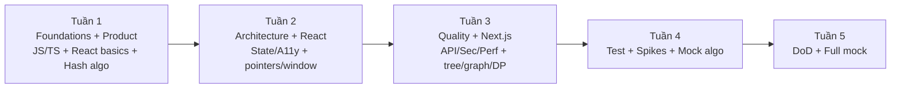

# Plan ôn tập 30 ngày v2 — Senior Front-End (Parker)

**Lịch:** Day 1 = **03/10/2026** → Day 30 = **01/11/2026** (DD/MM/YYYY)  
**Timebox:** **90–120 phút/ngày** · ~25% đọc / 35% FE craft · Capstone / 25% React·Next lab / 15% Algo  
**Mục tiêu tháng:** Vững FE senior (product→ship) + **React/Next thực chiến** (bổ sung Vue background) + **coding round Easy→Medium**.

> Review plan cũ + redesign: xem mục **Chẩn đoán** bên dưới. Tracks chi tiết: [algorithms-track.md](./algorithms-track.md) · [react-next-track.md](./react-next-track.md)

### Tài liệu kèm

| Tên | File |
|---|---|
| Feature Template | [feature-template.md](./feature-template.md) |
| Definition of Done | [definition-of-done.md](./definition-of-done.md) |
| Self-check | [self-check-questions.md](./self-check-questions.md) |
| Capstone brief | [capstone-brief.md](./capstone-brief.md) |
| Algorithms track | [algorithms-track.md](./algorithms-track.md) |
| React/Next track | [react-next-track.md](./react-next-track.md) |

---

## Chẩn đoán plan cũ (v1)

| Vấn đề | Hệ quả | Cách v2 xử lý |
|---|---|---|
| Docs-heavy, code spike muộn (Day 27–28) | Yếu live coding / React hands-on | Lab React mỗi ngày từ Day 1; spike sớm hơn về mặt kỹ năng |
| Không có Algorithms | Rớt coding round | 15–25′ Algo/ngày + mock Day 24/30 |
| React/Next mỏng (đối chiếu giấy) | Vue specialist thiếu depth | Track React/Next riêng + KB `react.md`/`nextjs.md` |
| Thiếu ngày JS/TS/CSS nền | Hổng câu hỏi fundamentals | Tuần 1 nhúng JS/TS; tuần 2 CSS/a11y |
| Timebox 60–90′ | Không đủ 3 track | Nâng 90–120′ (có dual-track skip rule) |
| Copy “không có file React” | Lệch repo thực tế | Trỏ đúng KB React/Next đã có |

**Giữ từ v1:** Capstone Customer Verification, worksheets, DoD, Feature Template, vòng Product→Arch→Quality→Ship.

---

## Cách học mỗi ngày (bắt buộc 4 khối)

1. **FE Craft / Capstone** (30–40′) — artifact worksheet
2. **React / Next Lab** (25–35′) — code chạy được trong lab repo
3. **Algo Drill** (15–25′) — TypeScript, ghi pattern + Big-O
4. **Checkpoint** — tự tick trước khi mark Day done

**Escape hatch:** nếu chỉ có 75′, ưu tiên thứ tự **Checkpoint-critical**: Craft → React lab → Algo (skip polish). Không skip React 2 ngày liên tiếp.

### Setup lab (chốt Day 6)

```bash
npm create vite@latest fe-react-lab -- --template react-ts
npx create-next-app@latest fe-next-lab
```

---

## Luồng tháng


```mermaid
flowchart LR
  W1["Tuần 1<br/>Foundations + Product<br/>JS/TS + React basics + Hash algo"] --> W2["Tuần 2<br/>Architecture + React<br/>State/A11y + pointers/window"]
  W2 --> W3["Tuần 3<br/>Quality + Next.js<br/>API/Sec/Perf + tree/graph/DP"]
  W3 --> W4["Tuần 4<br/>Test + Spikes + Mock algo"]
  W4 --> W5["Tuần 5<br/>DoD + Full mock"]
```

| Tuần | Theme | Capstone | React/Next | Algo |
|---|---|---|---|---|
| **1** | Foundations + Product | Flow, UI, forms, table, AC, work plan, kickoff | Mental model → hooks → forms → lists → lab setup | HashMap / Set / Stack intro |
| **2** | Architecture + A11y | Tree, state, types, DS, responsive, modal, keyboard | Smart/dumb, Context, reducer, compound, portal | Binary search, two pointers, sliding window, LL |
| **3** | Quality + Next | API, errors, security, race, perf, obs, CI | React Query, ErrorBoundary, memo, **App Router**, cache | BFS/DFS, islands, DP lite |
| **4** | Test + Ship | Test plan, E2E, AI, review, **Vue+React spikes** | RTL, MSW, Server Actions, Next Capstone page | DP review + live sim |
| **5** | Close | DoD + mock | Polish + interview Q bank | Flashcards + live in mock |

### Calendar

| Day | Ngày | Chủ đề |
|---:|---|---|
| 1 | 03/10/2026 | JS core + User flow |
| 2 | 04/10/2026 | this/event loop + UI critique |
| 3 | 05/10/2026 | Promises + Forms |
| 4 | 06/10/2026 | TS + Data-heavy table |
| 5 | 07/10/2026 | Product AC + custom hooks |
| 6 | 08/10/2026 | Work management + React lab setup |
| 7 | 09/10/2026 | Capstone kickoff + composition |
| 8 | 10/10/2026 | Component architecture |
| 9 | 11/10/2026 | State ownership |
| 10 | 12/10/2026 | Data flow + TypeScript |
| 11 | 13/10/2026 | Design system primitives |
| 12 | 14/10/2026 | Responsive trade-offs |
| 13 | 15/10/2026 | A11y modal |
| 14 | 16/10/2026 | Keyboard review + week pack |
| 15 | 17/10/2026 | API contract + React Query |
| 16 | 18/10/2026 | Error matrix + Error Boundary |
| 17 | 19/10/2026 | FE security |
| 18 | 20/10/2026 | Race conditions + AbortController |
| 19 | 21/10/2026 | Performance + React memo |
| 20 | 22/10/2026 | Observability + Next App Router |
| 21 | 23/10/2026 | CI + Next data caching |
| 22 | 24/10/2026 | Test pyramid + RTL |
| 23 | 25/10/2026 | Form/API tests Vue+React |
| 24 | 26/10/2026 | E2E + coding interview sim |
| 25 | 27/10/2026 | AI-assisted + Server Actions |
| 26 | 28/10/2026 | Code review + Next Capstone page |
| 27 | 29/10/2026 | Capstone Vue spike |
| 28 | 30/10/2026 | Capstone React/Next spike |
| 29 | 31/10/2026 | DoD + delivery notes |
| 30 | 01/11/2026 | Full mock interview |

---

# Tuần 1 · Foundations + Product (03/10/2026 – 09/10/2026)

### Day 1 — 03/10/2026 · JS core + User flow

**Mục tiêu:** Nắm closures/scope đủ giải thích phỏng vấn + có user flow Capstone rõ.

**Đọc**
- documents/vi/javascript.md — scope, closures, hoisting
- capstone-brief.md
- react-next-track.md (overview)
- algorithms-track.md (overview)

**1) FE Craft / Capstone**
- Vẽ Capstone flow List→Filter→Select→View→Edit→Save; liệt kê persona, happy path, 5 edge cases, AC draft.

**2) React / Next Lab**
- Đọc mental model React vs Vue (component = function). Tạo app Vite React+TS skeleton (hoặc note Day 6 setup nếu chưa kịp). Viết 1 component Hello + props.

**3) Algo Drill**
- Two Sum (Easy) — HashMap pattern. Ghi O(n)/O(n).

**Checkpoint (xong Day 1 khi)**
- Giải thích closure bằng 1 ví dụ; show flow Capstone; code Two Sum chạy đúng 2 test.

**Artifact:** [`artifacts/day-01-user-flow.md`](./artifacts/day-01-user-flow.md) · Starter: [`day-01-starter.md`](./day-01-starter.md)

---

### Day 2 — 04/10/2026 · this/event loop + UI critique

**Mục tiêu:** Giải thích this + micro/macrotask; critique UI admin có hierarchy rõ.

**Đọc**
- documents/vi/javascript.md — this, event loop
- documents/vi/architecture.md — presentational vs container
- documents/vi/react.md — rendering mental model

**1) FE Craft / Capstone**
- Critique 1 admin page: primary action, empty/loading/error, 8–10 UX issues + sketch redesign.

**2) React / Next Lab**
- Lab: useState counter + conditional render. So sánh với ref Vue. Giải thích re-render khi setState.

**3) Algo Drill**
- Valid Anagram — frequency map.

**Checkpoint (xong Day 2 khi)**
- Nói được thứ tự log của 1 snippet Promise/setTimeout; có UI critique; Anagram pass.

**Artifact:** [`artifacts/day-02-ui-critique.md`](./artifacts/day-02-ui-critique.md) · Starter: [`day-02-starter.md`](./day-02-starter.md)

---

### Day 3 — 05/10/2026 · Promises + Forms

**Mục tiêu:** Spec form state machine + viết controlled form React.

**Đọc**
- documents/vi/javascript.md — Promise/async
- documents/vi/accessibility.md — forms
- documents/vi/vue3.md — v-model
- documents/vi/react.md — controlled inputs

**1) FE Craft / Capstone**
- Map field→rule→error UI→disable Save. State machine pristine→dirty→validating→invalid→submitting→success|error.

**2) React / Next Lab**
- Lab: form Profile (name, email) controlled, validate on blur + submit, disable button khi invalid. So với v-model.

**3) Algo Drill**
- Contains Duplicate — Set.

**Checkpoint (xong Day 3 khi)**
- Form React chạy được validation; state machine ghi đủ transitions; Set solution O(n).

**Artifact:** [`artifacts/day-03-form-states.md`](./artifacts/day-03-form-states.md) · Starter: [`day-03-starter.md`](./day-03-starter.md)

---

### Day 4 — 06/10/2026 · TS + Data-heavy table

**Mục tiêu:** Type được row model; chiến lược table 500+ rows; list React có key đúng.

**Đọc**
- documents/vi/typescript.md — interfaces, unions, generics cơ bản
- documents/vi/performance.md — list virtualization skim
- documents/vi/react.md — lists & keys

**1) FE Craft / Capstone**
- Spec table Capstone: columns, filter, sort, pagination vs virtualize — chọn 1 approach + lý do.

**2) React / Next Lab**
- Lab: render table 50 rows từ mock data typed bằng TS interface; filter client-side; giải thích key ổn định.

**3) Algo Drill**
- Group Anagrams — map sorted key / count key.

**Checkpoint (xong Day 4 khi)**
- Có TS type cho CustomerRow; table React filter được; Group Anagrams đúng.

**Artifact:** [`artifacts/day-04-data-heavy.md`](./artifacts/day-04-data-heavy.md) · Starter: [`day-04-starter.md`](./day-04-starter.md)

---

### Day 5 — 07/10/2026 · Product AC + custom hooks

**Mục tiêu:** AC v1 Capstone testable; viết custom hook React đầu tiên.

**Đọc**
- self-check-questions.md — Product
- documents/vi/react.md — custom hooks
- capstone 03-acceptance-criteria.md

**1) FE Craft / Capstone**
- Viết AC Given/When/Then cho List filter + Edit save (ít nhất 6 AC). Copy sang capstone/03.

**2) React / Next Lab**
- Lab: extract useLocalStorage(key, initial) hoặc useToggle — dùng trong form Day 3.

**3) Algo Drill**
- Top K Frequent Elements (Medium lite) — map + sort hoặc bucket.

**Checkpoint (xong Day 5 khi)**
- AC đo được (pass/fail); hook tái sử dụng được; Top K chạy sample.

**Artifact:** [`artifacts/day-05-product-review.md`](./artifacts/day-05-product-review.md) · Starter: [`day-05-starter.md`](./day-05-starter.md)

---

### Day 6 — 08/10/2026 · Work management + React lab setup

**Mục tiêu:** Break Capstone thành ~12 tasks; lab React/Next sẵn sàng xuyên tháng.

**Đọc**
- documents/vi/leadership.md — estimate / prioritization skim
- react-next-track.md — setup

**1) FE Craft / Capstone**
- Work plan: task id, estimate (S/M/L), dependency, risk. Highlight 3 task critical path.

**2) React / Next Lab**
- Chốt setup: fe-react-lab (Vite) + (optional) fe-next-lab. README lab: scripts, folder day-NN convention.

**3) Algo Drill**
- Valid Parentheses — Stack.

**Checkpoint (xong Day 6 khi)**
- Work plan ≥10 tasks; repo lab chạy `npm run dev`; Parentheses pass.

**Artifact:** [`artifacts/day-06-work-plan.md`](./artifacts/day-06-work-plan.md) · Starter: [`day-06-starter.md`](./day-06-starter.md)

---

### Day 7 — 09/10/2026 · Capstone kickoff + composition

**Mục tiêu:** Feature Template + wireframes; hiểu composition React (children).

**Đọc**
- feature-template.md
- capstone/00 + 02
- documents/vi/react.md — composition / children

**1) FE Craft / Capstone**
- Điền Feature Template Capstone; wireframe text 3 màn List/Detail/Config.

**2) React / Next Lab**
- Lab: Card/Layout components dùng children; so với slots Vue. Không prop-drill title+body nếu dùng composition.

**3) Algo Drill**
- Weekly review: re-solve Two Sum + Parentheses trong 15′ (timed).

**Checkpoint (xong Day 7 khi)**
- Template + wireframes xong; composition lab PR/commit; timed algo OK.

**Artifact:** [`artifacts/capstone/00-feature-template.md`](./artifacts/capstone/00-feature-template.md) · Starter: [`day-07-starter.md`](./day-07-starter.md)

---

# Tuần 2 · Architecture + React (10/10/2026 – 16/10/2026)

### Day 8 — 10/10/2026 · Component architecture

**Mục tiêu:** Component tree Capstone + trách nhiệm rõ; mirror tree bên React.

**Đọc**
- documents/vi/architecture.md
- documents/vi/vue3.md — component design
- documents/vi/react.md — presentational vs container

**1) FE Craft / Capstone**
- Vẽ component tree List page (smart vs dumb). Ghi props/events từng node → capstone/04.

**2) React / Next Lab**
- Lab: tách CustomerTable (dumb) + CustomersPage (smart fetch mock). Không fetch trong dumb.

**3) Algo Drill**
- Binary Search (sorted array) — iterative.

**Checkpoint (xong Day 8 khi)**
- Tree 2 phía Vue-thinking + React lab khớp trách nhiệm; binary search O(log n).

**Artifact:** [`artifacts/day-08-component-tree.md`](./artifacts/day-08-component-tree.md) · Starter: [`day-08-starter.md`](./day-08-starter.md)

---

### Day 9 — 11/10/2026 · State ownership

**Mục tiêu:** Map source of truth Capstone; Context vs Zustand quyết định có lý do.

**Đọc**
- documents/vi/state-management.md
- documents/vi/state-management-react.md

**1) FE Craft / Capstone**
- Bảng state: data · owner · who writes · who reads · sync server? → capstone/05.

**2) React / Next Lab**
- Lab: lift filter state lên page; thử Context cho theme/auth mock; viết note khi nào cần Zustand.

**3) Algo Drill**
- Two Sum II / Two Pointers trên sorted array.

**Checkpoint (xong Day 9 khi)**
- State map không còn “mọi thứ trong page”; Context demo chạy; two pointers đúng.

**Artifact:** [`artifacts/day-09-state-map.md`](./artifacts/day-09-state-map.md) · Starter: [`day-09-starter.md`](./day-09-starter.md)

---

### Day 10 — 12/10/2026 · Data flow + TypeScript

**Mục tiêu:** DTO + Save flow typed; useReducer form phức tạp.

**Đọc**
- documents/vi/typescript.md — discriminated unions
- documents/vi/react.md — useReducer

**1) FE Craft / Capstone**
- Định nghĩa types Customer, FieldConfig, ApiError. Sequence Save (optimistic vs pessimistic).

**2) React / Next Lab**
- Lab: form FieldConfig dùng useReducer (update_field | validate | submit_*).

**3) Algo Drill**
- Longest Substring Without Repeating — Sliding Window.

**Checkpoint (xong Day 10 khi)**
- Types compile; reducer transitions rõ; sliding window O(n).

**Artifact:** [`artifacts/day-10-types-and-flow.md`](./artifacts/day-10-types-and-flow.md) · Starter: [`day-10-starter.md`](./day-10-starter.md)

---

### Day 11 — 13/10/2026 · Design system primitives

**Mục tiêu:** Spec Button/FormField/Empty/Error; compound component pattern React.

**Đọc**
- documents/vi/css-layout.md — skim tokens
- documents/vi/react.md — compound components

**1) FE Craft / Capstone**
- Spec 4 primitives: API props, variants, a11y notes, empty/error copy.

**2) React / Next Lab**
- Lab: <Tabs> compound (Tabs, TabsList, TabsTrigger, TabsContent) bằng Context nội bộ.

**3) Algo Drill**
- Min Stack — design O(1) getMin.

**Checkpoint (xong Day 11 khi)**
- Spec đủ để handoff; Tabs lab keyboard-ish; Min Stack đúng.

**Artifact:** [`artifacts/day-11-design-primitives.md`](./artifacts/day-11-design-primitives.md) · Starter: [`day-11-starter.md`](./day-11-starter.md)

---

### Day 12 — 14/10/2026 · Responsive trade-offs

**Mục tiêu:** Chọn strategy table mobile; CSS layout React lab.

**Đọc**
- documents/vi/css-layout.md
- capstone/08-responsive-strategy.md

**1) FE Craft / Capstone**
- So sánh scroll-x vs hide cols vs card stack — chọn 1 + anti-patterns → capstone/08.

**2) React / Next Lab**
- Lab: cùng data, breakpoint chuyển table→cards (CSS hoặc matchMedia hook).

**3) Algo Drill**
- Reverse Linked List (iterative) — nếu chưa có LL util, implement ListNode.

**Checkpoint (xong Day 12 khi)**
- Có quyết định responsive ghi rõ trade-off; lab đổi layout; reverse list OK.

**Artifact:** [`artifacts/day-12-responsive-tradeoffs.md`](./artifacts/day-12-responsive-tradeoffs.md) · Starter: [`day-12-starter.md`](./day-12-starter.md)

---

### Day 13 — 15/10/2026 · A11y modal

**Mục tiêu:** Modal a11y checklist + implement dialog React (focus trap tối thiểu).

**Đọc**
- documents/vi/accessibility.md
- documents/vi/react.md — portals

**1) FE Craft / Capstone**
- Checklist: focus trap, Esc, return focus, aria-modal, labelledby → bắt đầu capstone/09.

**2) React / Next Lab**
- Lab: Modal bằng createPortal; Esc đóng; focus nút đầu; restore focus khi unmount.

**3) Algo Drill**
- Linked List Cycle — Floyd.

**Checkpoint (xong Day 13 khi)**
- Modal lab đạt 4/5 a11y checks; checklist Capstone update; Floyd OK.

**Artifact:** [`artifacts/day-13-modal-a11y.md`](./artifacts/day-13-modal-a11y.md) · Starter: [`day-13-starter.md`](./day-13-starter.md)

---

### Day 14 — 16/10/2026 · Keyboard review + week pack

**Mục tiêu:** Keyboard test Capstone screens; đóng gói artifact tuần 2; React a11y pass.

**Đọc**
- documents/vi/accessibility.md — keyboard
- self-check Architecture/A11y

**1) FE Craft / Capstone**
- Test Tab/Shift+Tab/Enter/Esc trên flow chính; ghi bug list; pack artifacts 04/05/08/09.

**2) React / Next Lab**
- Lab: audit Day 13 Modal + form Day 3 bằng keyboard only; sửa 2 issue.

**3) Algo Drill**
- Week 2 review timed: Binary Search + Sliding Window (20′).

**Checkpoint (xong Day 14 khi)**
- Có keyboard result sheet; ≥1 bug fixed trong lab; timed algo xong.

**Artifact:** [`artifacts/day-14-keyboard-result.md`](./artifacts/day-14-keyboard-result.md) · Starter: [`day-14-starter.md`](./day-14-starter.md)

---

# Tuần 3 · Quality + Next.js (17/10/2026 – 23/10/2026)

### Day 15 — 17/10/2026 · API contract + React Query

**Mục tiêu:** Contract GET/PATCH Capstone; fetch với cache/stale policy.

**Đọc**
- documents/vi/networking.md
- documents/vi/react.md — data fetching
- documents/vi/nextjs.md — skim fetch

**1) FE Craft / Capstone**
- Viết contract endpoints List/Detail/Patch + error shape → capstone/06.

**2) React / Next Lab**
- Lab: dùng @tanstack/react-query (hoặc SWR) load customers mock; loading/error/success states.

**3) Algo Drill**
- Binary Tree Level Order — BFS queue.

**Checkpoint (xong Day 15 khi)**
- Contract review được; query lab không race khi remount nhanh; BFS đúng.

**Artifact:** [`artifacts/day-15-api-contract.md`](./artifacts/day-15-api-contract.md) · Starter: [`day-15-starter.md`](./day-15-starter.md)

---

### Day 16 — 18/10/2026 · Error matrix + Error Boundary

**Mục tiêu:** Map status→UX; Error Boundary + 401 refresh flow notes.

**Đọc**
- documents/vi/practical-questions.md — debug
- documents/vi/react.md — error boundaries

**1) FE Craft / Capstone**
- Matrix 400/401/403/404/422/500 → toast/inline/full-page/retry → capstone/07.

**2) React / Next Lab**
- Lab: ErrorBoundary class (hoặc library) bọc page; fallback UI + retry. Note: boundary không bắt lỗi async event.

**3) Algo Drill**
- Maximum Depth of Binary Tree — DFS.

**Checkpoint (xong Day 16 khi)**
- Matrix đủ 6 status; Boundary demo; DFS depth đúng.

**Artifact:** [`artifacts/day-16-error-matrix.md`](./artifacts/day-16-error-matrix.md) · Starter: [`day-16-starter.md`](./day-16-starter.md)

---

### Day 17 — 19/10/2026 · FE security

**Mục tiêu:** XSS/authz/storage checklist Capstone; biết nguy cơ React XSS.

**Đọc**
- documents/vi/security.md
- documents/vi/react.md — dangerouslySetInnerHTML

**1) FE Craft / Capstone**
- Checklist security Capstone (token storage, XSS surfaces, CSRF nếu cookie) → capstone/10.

**2) React / Next Lab**
- Lab: cố ý render HTML string an toàn (escape) vs dangerouslySetInnerHTML — ghi khi nào được phép.

**3) Algo Drill**
- Lowest Common Ancestor of BST (hoặc Binary Tree) — chọn 1.

**Checkpoint (xong Day 17 khi)**
- Checklist ≥8 items actionable; XSS note rõ; LCA pass sample.

**Artifact:** [`artifacts/day-17-security.md`](./artifacts/day-17-security.md) · Starter: [`day-17-starter.md`](./day-17-starter.md)

---

### Day 18 — 20/10/2026 · Race conditions + AbortController

**Mục tiêu:** Biết stale response; cleanup useEffect đúng.

**Đọc**
- documents/vi/javascript.md — abort/race
- documents/vi/react.md — useEffect cleanup

**1) FE Craft / Capstone**
- Viết investigation log “search race”: reproduce, root cause, fix (ignore stale / abort / seq id).

**2) React / Next Lab**
- Lab: search-as-you-type với AbortController; verify request cũ bị abort khi gõ tiếp.

**3) Algo Drill**
- Number of Islands — Graph BFS/DFS trên grid.

**Checkpoint (xong Day 18 khi)**
- Có fix pattern ghi trong Capstone notes; lab abort hoạt động; Islands OK.

**Artifact:** [`artifacts/day-18-debug-stale-ui.md`](./artifacts/day-18-debug-stale-ui.md) · Starter: [`day-18-starter.md`](./day-18-starter.md)

---

### Day 19 — 21/10/2026 · Performance + React memo

**Mục tiêu:** Bottleneck list Capstone; biết khi nào memo/useMemo có ích.

**Đọc**
- documents/vi/performance.md
- documents/vi/react.md — memo, useMemo, useCallback

**1) FE Craft / Capstone**
- Perf review: 3 bottleneck + đo giả định + fix → capstone/11.

**2) React / Next Lab**
- Lab: list chậm giả lập; tối ưu bằng memo hóa row; profile bằng React Profiler (DevTools) — ghi trước/sau.

**3) Algo Drill**
- Climbing Stairs — DP intro.

**Checkpoint (xong Day 19 khi)**
- Perf sheet có số; Profiler screenshot/note; DP stairs O(n).

**Artifact:** [`artifacts/day-19-performance.md`](./artifacts/day-19-performance.md) · Starter: [`day-19-starter.md`](./day-19-starter.md)

---

### Day 20 — 22/10/2026 · Observability + Next App Router

**Mục tiêu:** Logging/CWV plan; tạo Next app router đầu tiên.

**Đọc**
- documents/vi/monitoring.md
- documents/vi/nextjs.md — App Router, layouts
- documents/vi/build-tools.md — skim bundle

**1) FE Craft / Capstone**
- Plan: gì log ở FE, correlation id, error reporting; lazy route list.

**2) React / Next Lab**
- Lab Next: app/ layout + page customers (RSC mặc định) + 1 Client Component interactive filter.

**3) Algo Drill**
- Coin Change (unbounded) — DP lite (hoặc BFS nếu DP kẹt).

**Checkpoint (xong Day 20 khi)**
- Obs notes; Next /customers render; phân biệt Server vs Client component được.

**Artifact:** [`artifacts/day-20-observability.md`](./artifacts/day-20-observability.md) · Starter: [`day-20-starter.md`](./day-20-starter.md)

---

### Day 21 — 23/10/2026 · CI + Next data caching

**Mục tiêu:** CI gates ngắn; hiểu cache Next fetch.

**Đọc**
- documents/vi/devops.md
- documents/vi/nextjs.md — caching, revalidate

**1) FE Craft / Capstone**
- ADR ½ trang: chọn test gate (lint/typecheck/unit) + lý do. Pipeline checklist.

**2) React / Next Lab**
- Lab Next: fetch mock với `revalidate` / `no-store`; ghi bảng “khi nào cache”.

**3) Algo Drill**
- Week 3 review: Islands + Climbing Stairs timed 20′.

**Checkpoint (xong Day 21 khi)**
- ADR + CI list; cache table ≥4 rows; timed algo xong.

**Artifact:** [`artifacts/day-21-ci-and-adr.md`](./artifacts/day-21-ci-and-adr.md) · Starter: [`day-21-starter.md`](./day-21-starter.md)

---

# Tuần 4 · Test + Spikes + Algo mock (24/10/2026 – 30/10/2026)

### Day 22 — 24/10/2026 · Test pyramid + RTL

**Mục tiêu:** Map behaviors→layers; viết test RTL đầu tiên.

**Đọc**
- documents/vi/testing.md
- documents/vi/react.md — testing library mindset

**1) FE Craft / Capstone**
- Test plan Capstone: unit/component/E2E cho Save flow → capstone/12.

**2) React / Next Lab**
- Lab: RTL test form validate (userEvent). Không test implementation detail.

**3) Algo Drill**
- DP review: House Robber (Easy/Medium) hoặc re-do Coin Change.

**Checkpoint (xong Day 22 khi)**
- Pyramid map; ≥2 RTL tests green; DP OK.

**Artifact:** [`artifacts/day-22-test-plan.md`](./artifacts/day-22-test-plan.md) · Starter: [`day-22-starter.md`](./day-22-starter.md)

---

### Day 23 — 25/10/2026 · Form/API tests Vue+React

**Mục tiêu:** So sánh VTU vs RTL; mock API (MSW hoặc vi.mock).

**Đọc**
- documents/vi/testing.md
- documents/vi/vue3.md — testing skim

**1) FE Craft / Capstone**
- Viết pseudo + real snippet: 1 test Vue + 1 test React cùng behavior “save success toast”.

**2) React / Next Lab**
- Lab: MSW (hoặc mock fetch) cho PATCH success/401; assert UI.

**3) Algo Drill**
- Mock set warm-up: 1 Easy tự chọn (≤10′).

**Checkpoint (xong Day 23 khi)**
- Bảng so sánh VTU/RTL; React test 401 path; warm-up xong.

**Artifact:** [`artifacts/day-23-test-snippets-vue-react.md`](./artifacts/day-23-test-snippets-vue-react.md) · Starter: [`day-23-starter.md`](./day-23-starter.md)

---

### Day 24 — 26/10/2026 · E2E + coding interview sim

**Mục tiêu:** 1 E2E critical path; 45′ live coding giả lập.

**Đọc**
- documents/vi/testing.md — E2E
- algorithms-track.md

**1) FE Craft / Capstone**
- Spec Playwright scenario: login(/mock) → filter → open detail → save. Ghi CI gate.

**2) React / Next Lab**
- Lab: chạy E2E trên Next/React lab (1 smoke) HOẶC script manual checklist nếu chưa cài PW.

**3) Algo Drill**
- Live sim 45′: làm 2 bài (1 Easy + 1 Medium từ tuần 1–3) không xem lời giải. Chấm sau.

**Checkpoint (xong Day 24 khi)**
- E2E spec/CI note; có điểm self-score algo (pass/partial/fail).

**Artifact:** [`artifacts/day-24-e2e-and-ci.md`](./artifacts/day-24-e2e-and-ci.md) · Starter: [`day-24-starter.md`](./day-24-starter.md)

---

### Day 25 — 27/10/2026 · AI-assisted + Server Actions

**Mục tiêu:** Dùng AI có audit trail; thử Server Action Next.

**Đọc**
- documents/vi/practical-questions.md
- documents/vi/nextjs.md — server actions

**1) FE Craft / Capstone**
- Prompt AI implement 1 util; audit bugs/security; ghi evidence → capstone/13.

**2) React / Next Lab**
- Lab Next: form submit qua Server Action (mock), progressive enhancement note.

**3) Algo Drill**
- Weak-topic drill: chọn pattern yếu nhất tuần 1–3, 2 bài.

**Checkpoint (xong Day 25 khi)**
- AI evidence trước/sau; Server Action chạy; weak drill note.

**Artifact:** [`artifacts/day-25-ai-review.md`](./artifacts/day-25-ai-review.md) · Starter: [`day-25-starter.md`](./day-25-starter.md)

---

### Day 26 — 28/10/2026 · Code review + Next Capstone page

**Mục tiêu:** Review checklist; dựng 1 page Capstone trên Next.

**Đọc**
- definition-of-done.md
- documents/vi/leadership.md — review

**1) FE Craft / Capstone**
- Checklist review (correctness, a11y, security, perf, tests) → capstone/14. Self-review lab.

**2) React / Next Lab**
- Lab Next: Customers List page theo AC Day 5 (mock data) — loading/empty/error/table.

**3) Algo Drill**
- Weak-topic drill #2 (15′).

**Checkpoint (xong Day 26 khi)**
- Checklist dùng được; List page Next demo; drill xong.

**Artifact:** [`artifacts/day-26-code-review.md`](./artifacts/day-26-code-review.md) · Starter: [`day-26-starter.md`](./day-26-starter.md)

---

### Day 27 — 29/10/2026 · Capstone Vue spike

**Mục tiêu:** Ship 1 vertical slice Vue/TS (List hoặc Field Config).

**Đọc**
- documents/vi/vue3.md
- documents/vi/state-management.md
- artifacts/capstone/spikes/vue/README.md

**1) FE Craft / Capstone**
- Code spike Vue: fetch mock + table + filter + empty/error. README ghi trade-offs.

**2) React / Next Lab**
- Parity note: liệt kê API/composable sẽ map sang hooks ngày mai (bảng Vue→React).

**3) Algo Drill**
- Off / flashcard Big-O 10′ (giữ sức cho spike).

**Checkpoint (xong Day 27 khi)**
- Spike Vue chạy được happy path; parity table sẵn cho Day 28.

**Artifact:** [`artifacts/day-27-vue-spike.md`](./artifacts/day-27-vue-spike.md) · Starter: [`day-27-starter.md`](./day-27-starter.md)

---

### Day 28 — 30/10/2026 · Capstone React/Next spike

**Mục tiêu:** Cùng slice với Day 27 bằng React + Next (ưu tiên Next nếu đã có lab).

**Đọc**
- documents/vi/react.md
- documents/vi/nextjs.md
- documents/vi/state-management-react.md
- artifacts/capstone/spikes/react/README.md

**1) FE Craft / Capstone**
- Spike React/Next đạt parity feature Vue spike. README: khác biệt DX, bundling, data fetching.

**2) React / Next Lab**
- Đây là ngày React chính: hoàn thiện slice + 1 test RTL smoke + note RSC/client boundary.

**3) Algo Drill**
- Off / hoặc 1 Easy cool-down 10′.

**Checkpoint (xong Day 28 khi)**
- Demo 2 spike cạnh nhau; nói được 3 khác biệt Vue vs React/Next.

**Artifact:** [`artifacts/day-28-react-spike.md`](./artifacts/day-28-react-spike.md) · Starter: [`day-28-starter.md`](./day-28-starter.md)

---

# Tuần 5 · Close + Mock interview (31/10/2026 – 01/11/2026)

### Day 29 — 31/10/2026 · DoD + delivery notes

**Mục tiêu:** Tick DoD; index deliverables 01–15; polish spike.

**Đọc**
- definition-of-done.md
- capstone/15-delivery-notes.md

**1) FE Craft / Capstone**
- Điền delivery notes; đánh dấu thiếu sót; polish README spikes.

**2) React / Next Lab**
- Polish Next page: empty/error copy, basic a11y, remove console noise.

**3) Algo Drill**
- Flashcards: 8 patterns + 1 bài random 15′.

**Checkpoint (xong Day 29 khi)**
- DoD ≥80% tick; delivery notes thẳng thắn về gap; flashcards xong.

**Artifact:** [`artifacts/capstone/15-delivery-notes.md`](./artifacts/capstone/15-delivery-notes.md) · Starter: [`day-29-starter.md`](./day-29-starter.md)

---

### Day 30 — 01/11/2026 · Full mock interview

**Mục tiêu:** Mock 60–90′: Capstone walkthrough + React Q + live coding.

**Đọc**
- self-check-questions.md
- algorithms-track.md

**1) FE Craft / Capstone**
- Outline trả lời 10–15′ Capstone (problem→constraints→architecture→trade-offs→tests). Ghi weak list hậu mock.

**2) React / Next Lab**
- Chuẩn bị 5 câu: hooks rules, useEffect deps, RSC vs client, key reconciliation, state library choice.

**3) Algo Drill**
- Live coding 2 bài trong mock (Easy+Medium), narrate while coding.

**Checkpoint (xong Day 30 khi)**
- Ghi điểm 3 phần (Capstone/React/Algo) + 5 việc ôn tiếp 7 ngày sau.

**Artifact:** [`artifacts/day-30-mock-outline.md`](./artifacts/day-30-mock-outline.md) · Starter: [`day-30-starter.md`](./day-30-starter.md)

---

## Definition of success sau Day 30

- [ ] Kể được Capstone 10–15′ có trade-offs
- [ ] Demo spike Vue + React/Next cùng slice
- [ ] Tự giải ≥12 bài Easy/Medium đúng pattern (hash→DP lite)
- [ ] Trả lời được hooks rules, RSC vs client, controlled inputs, Error Boundary limits
- [ ] Có weak-topic list + kế hoạch 7 ngày tiếp
